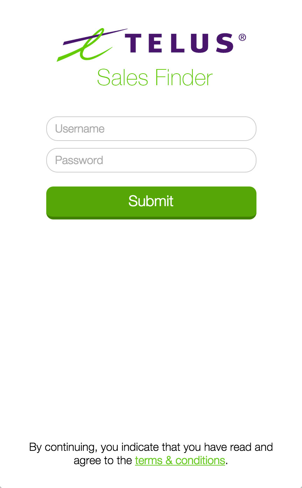
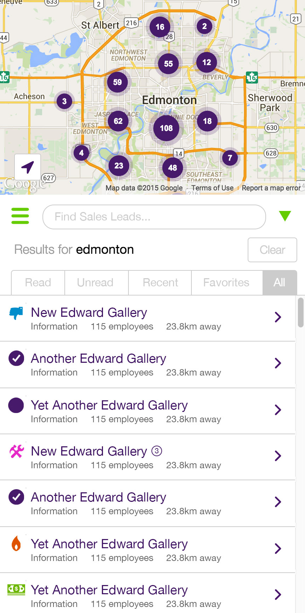
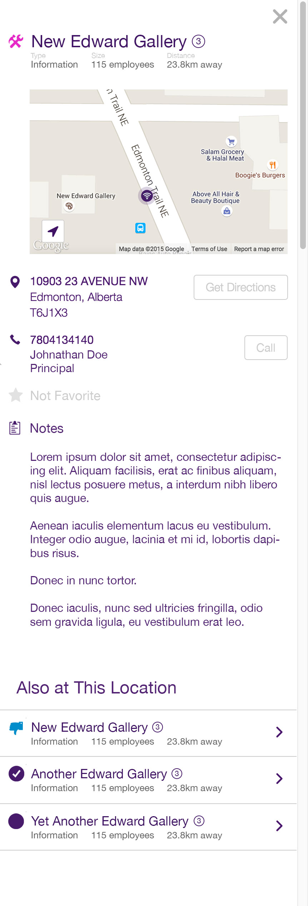
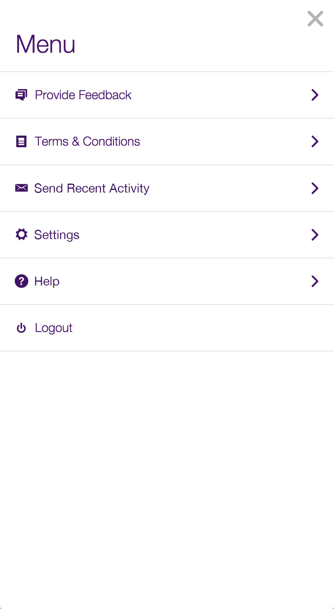
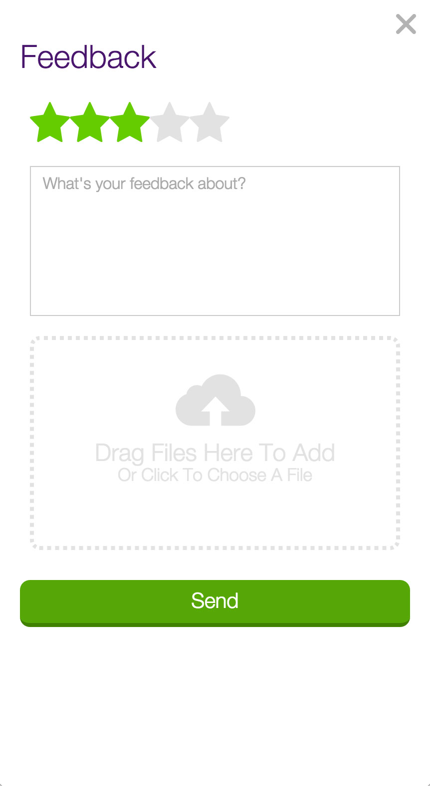
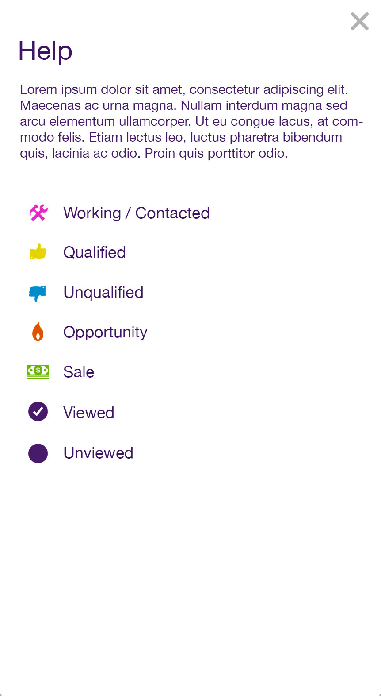
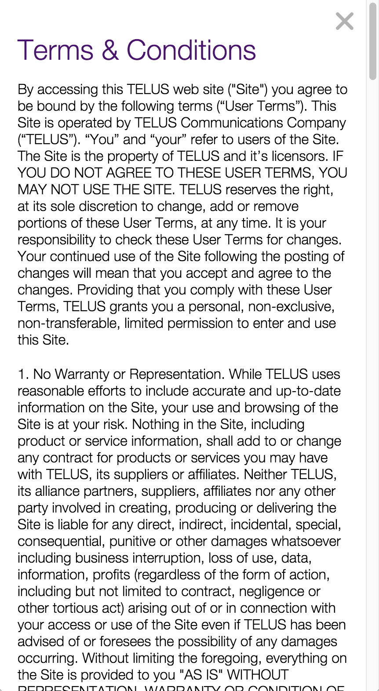
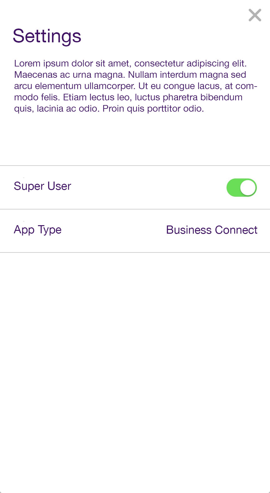
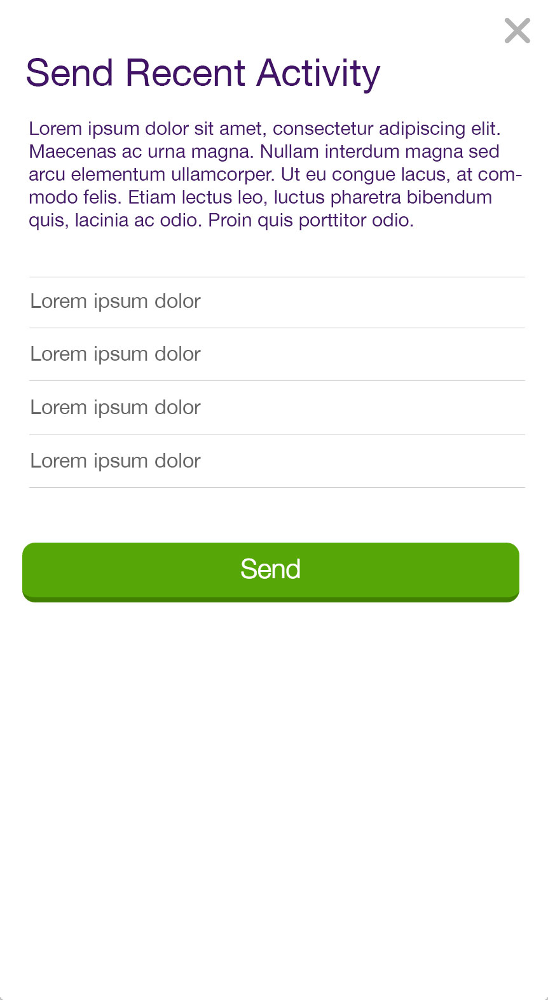

# Sales Finder Features

- all user data is stored locally in browser's indexeddb
- need web app + native phone app (e.g., using phonegap)
- switching users requires current user to logout, then new user to login
- acts just like wifi-finder except for specific sales functionality (e.g., list and map work the same way)

## Login

- submit username + password
- display error feedback to user
- authenticate with oauth server
- retrieve access token for resource server
- show "in progress" indicator while app is loading
- initialize app with data receive from the server

## Nameplate

- used both in Finder's list as well as header for Details
- display name of sales location
- # of employees
- distance from current location
- optional circled number indicating # of related sales at same location
- icon indicating status (status can be one of "working/contacts", "qualified", "unqualified", "opportunity", "sale", "viewed", "unviewed")
- tapping/clicking status icon opens modal menu that enables user to change the status (can be done anywhere the nameplate component is loaded such as from the finder or the details screens); this includes changing status back to "unviewed" if needed (e.g., opened a location by accident)

## Finder (List)

- menu button (opens menu screen)
- display list of sales locations nameplates (based on currently active filter; maximum of 100 in list)
	- click any sales location in the list will open its corresponding "details" panel (this panel will slide in from the right when on a desktop, or overlap the finder/list when on a phone... just like the wifi-finder)
- list toggle button (toggle list view open and closed; when closed, only see "menu" button + filter input at bottom of full-screen map)
- array of tabs to view sub-sections of list ("viewed", "unviewed", "recent", "favorites", and "all")
- google map
	- map displays individual sales location markers as well as clusters
	- map markers correspond one-to-one with sales locations in list (when list is filtered so are the map markers)
	- icons used for individual sales locations (as opposed to clusters) should be unique, based on the sales location's status (status can be one of "working/contacts", "qualified", "unqualified", "opportunity", "sale", "viewed", "unviewed")
	- map markers support multiple sales leads at the same location (TBD what that will look like when multiple icons are stacked on top of each other)
- filter sales by string (type something in the text input that matches a location's name, city, or address)
	- indicate the current string filter in the format "Results for <string>" with the ability to "clear" the filter in order to switch back to "no filter"
- find current location button (geolocates user's device and displays current location target on map, zooming in and panning to that location)

## Details

- display details for individual sales location:
	- nameplate
	- map snapshot with marker at sales location (clicking on map snapshot will open maps.google.com at that location)
	- address (tapping address will trigger "get directions")
	- explicit "get directions" button
	- phone number (tapping will trigger phone if on mobile device, unless set to "do not call")
	- explict "call" button (does not show up if set to "do not call")
	- contact name
	- contact title
	- favorite
	- notes (editable by user by tapping on text)
- if sales location was previous "unviewed", the act of viewing its details page will automatically change its status to "viewed"
- list of related sales that share location coordinates displayed as nameplates
- clicking related nameplates will change screen to the details view of the clicked nameplate sales location
- ability to toggle "do not call" setting

## Menu

- select one of the feedback, help, settings, terms, or recent-activity
- logout

## Feedback

- choose a rating between 1 and 5 stars
- input a free-form text message
- attach 1 or more files
- send feedback to administrator

## Help

- display legend of icons and their associated meaning
- provide simple step-by-step instruction on using the finder

## Terms & Conditions

- display terms and conditions

## Settings

- switch between user and super-user
- switch between "business connect" and "swift"

## Sync Recent Activity

- display recent changes in a list
- export recent changes as .csv file formatted for Sales Force
- email export to user's email address