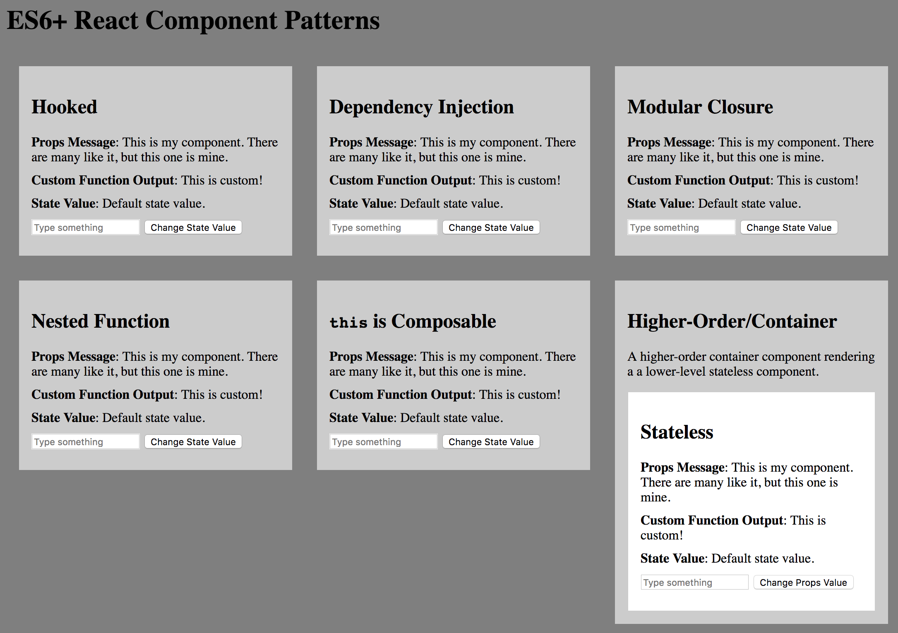

(updated for React 16.7.0-alpha)

[Get the code](https://github.com/robmclarty/es6-react-component)

There's more than one way to create a React component. The old way (using the
`React.createClass` function) has now been deprecated in version 16. But that
doesn't mean you're stuck using the classical inheritance pattern.

**UPDATE**: With the introduction of [Hooks](https://reactjs.org/docs/hooks-intro.html)
in React 16.7, this is now my preferred component style (see [Hooked Component Example](./src/javascripts/Hooked.js)).
My thoughts below, as well as the other examples, are still relevant, however
Hooks now provide a powerful, simple, and direct way of making components that
has all the composable clarity I've always desired without all the added hoops
to jump through.

You should still, always, use a stateless function component whenever possible,
but if you need other React features, you can now import them as needed without
rewriting your component into a classical mess of binded `this`s :)

Usage
-----

From the root of the project directory:

1. `npm install`
2. `npm run build`
3. Open `/build/index.html` in your web browser.

Why?
----

I'm just going to say this right off the bat: I'm not a fan of OOP, and I don't
think adding `class` to Javascript was a good thing.

I prefer composition over inheritance in almost all cases, and would rather use
Javascript's wonderfully expressive, and simple, features like functions and
object literals to create reusable modules.

But to each his/her own.

Aren't Stateless Function Components Better?
--------------------------------------------

Yes.

As a rule of thumb, you should *always* create "stateless function components"
whenever possible. These are modules which return a function that does nothing
other than render some JSX, along with inserting some props into the mix (but
do not track any kind of state). These are simpler, faster, and easier than
anything, so *always* use them!

...unless you need state. And then you should use one of the patterns in this
repo.

Facebook's examples use `class`, so that must be the best way
-------------------------------------------------------------

A lot of Java developers have moved over to JS and made a lot of noise to make
it look like what they're used to. That doesn't mean you should/have do it too.

By all means, if classes are your cup of tea, do what you think is best, but I
just want to show that there do exist alternatives; ones that don't require
`class`, or `this`, or `new` or `extends` or `super` or `bind` ;)

As of v16.7.0, you can now use [Hooks](https://reactjs.org/docs/hooks-intro.html)
to access React's features from a simple function component. You no longer need
to use classes.

Object's without classes? WTF?
------------------------------

Yes, you can make objects without inheriting from a class. And if you create an
object that quacks like a React component, React will think it's a React
component.

Basically, what's happening when you make a classless React component, is
this:

1. Make a new object that includes all the stuff in `React.Component.prototype`
2. Give that object some attributes called `props` and `state`
3. Define a special function called, specifically, `render()` which returns
some JSX stuff
4. Make a function that accepts `props`, and optionally `context`, and returns
this new object (passing the props into it).
5. Export the function as a module

This is essentially all there really is to a React component.

NOTE: [Hooks](https://reactjs.org/docs/hooks-intro.html) are an even easier way
of making components without classes (or understanding the `React.Component.prototype`).
I recommend using this method instead.

But isn't doing it the Facebook way better/safer/more optimized/faster?
-----------------------------------------------------------------------

No, not really. Not using classes can actually be *less* resource hungry,
be parsed even faster by the browser, and imo a heck of a lot easier to reason
about (read: faster development with fewer errors).

In testing, I've found each pattern to be roughly equivalent performance-wise.
The biggest difference lies in the code structure itself. I think the composable
examples are easier to read, easier to manipulate, and require less of a
developer's mental resources to construct, extend, maintain, and upgrade. For
this reason, I prefer not using classical components.

Further Reading
---------------

- [Introducing Hooks](https://reactjs.org/docs/hooks-intro.html)
- [Alternative Ways to Define React Components](https://gist.github.com/jquense/47bbd2613e0b03d7e51c)
- [Composition Over Inheritance](https://www.youtube.com/watch?v=wfMtDGfHWpA)
- [Baby's First Reaction](https://medium.com/javascript-scene/baby-s-first-reaction-2103348eccdd)
- [An easy guide to object rest/spread properties in JavaScript](https://dmitripavlutin.com/object-rest-spread-properties-javascript/)
- [Variables, Scopes, Environments, and Closures](http://speakingjs.com/es5/ch16.html)
