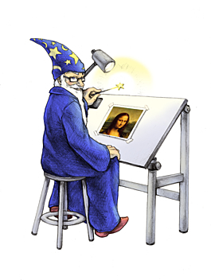
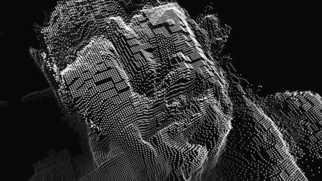
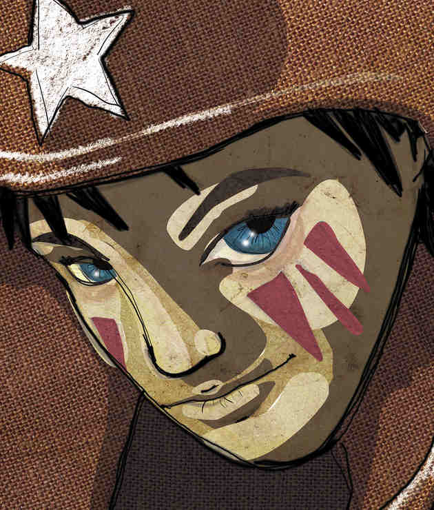
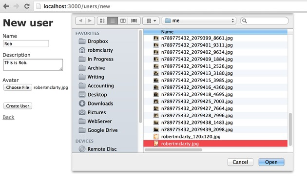
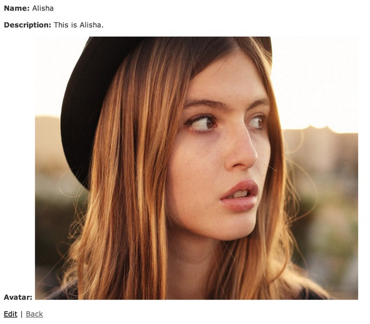
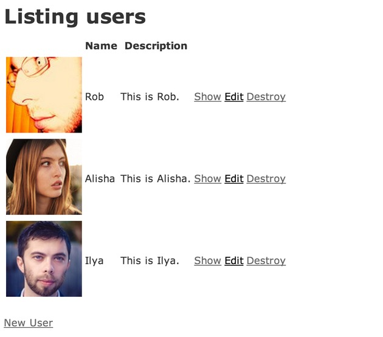

After I've got my basic app setup on my production server the next
major component I usually find myself installing is the ability to
handle file uploads and doing some server-side processing on any upload
images. This comes in handy for a variety of applications from file
attachments to user avatars. Every app likely needs a way for its users
to get stuff from their computer to the cloud.

In this article, I'll be assuming you've already setup your app along the lines
of my previous [two](/words/articles/how_to_setup_a_production_server_for_rails_4)
[posts](/words/articles/how_to_deploy_a_rails_4_app_with_git_and_capistrano)
and now want to include the ability for your users to include avatar
images along with their profiles. I'll show you have to install
[Image Magick](https://www.imagemagick.org/) from source, setup the
[Paperclip](https://github.com/thoughtbot/paperclip) gem, and include some basic
image functionality into your Rails app.

There are certainly plenty of other libraries you could opt for, and
you might need to handle different file types (not just images). I find
Image Magick to have great support on multiple platforms with a plethora
of options to cover nearly all of your image manipulation needs. On the
application side of things, I like using the Paperclip gem for its
simplicity and focused utility (it doesn't try to tell you how to do
things, but gives you flexible options to adapt to different
environments). I'm not trying to say these are your only options, just
that these work well and are a good place to start as far as "getting
stuff into the cloud" is concerned.

Back when I first started using Rails I used
[Attachment Fu](https://github.com/technoweenie/attachment_fu). But this has
long since stopped receiving updates. An alternative file upload gem that I
recommend is [Carrier Wave](https://github.com/carrierwaveuploader/carrierwave).
And on the front-end of things, there are some nice JS libraries out
there for making a more pleasant user experience (e.g., progress bars,
previews, cropping adjustments) like
[jquery.fileupload](http://blueimp.github.io/jQuery-File-Upload/) and
[dropzone.js](http://www.dropzonejs.com/). Feel free to explore these options
because I know they can add a great deal of value to your app.


Install Image Magick
--------------------



Assuming you've got a Debian-based production environment like Ubuntu, you'll
first need to install some dependencies using `apt-get`
for the various image formats you'd like to support. Image Magick
supports GIF out of the box, but you'll need to make sure the other
formats you want to support are ready to go with the following CLI
command (this adds support for JPEG, PNG, TIFF, and compression using
BZip). Other dependencies can be referenced from the
[Image Magick delegates page](http://www.imagemagick.org/download/delegates/).

```bash
sudo apt-get install libpng12-dev libglib2.0-dev zlib1g-dev libbz2-dev libtiff4-dev libjpeg8-dev
```

Next, you'll need to grab the source code and pull it over to your production
server. I like to put all my source code stuff in `~/src`, but feel free to put
it wherever you like. Image Magick maintains its
[latest release here](http://www.imagemagick.org/download).

```bash
cd ~/src
wget http://www.imagemagick.org/download/ImageMagick.tar.gz
tar -xzvf ImageMagick.tar.gz
cd ImageMagick
```

You should now be inside the newly uncompressed ImageMagick directory. Next,
we'll run the `configure`
script and compile all the source code, finally installing it in the
system. If you need to run any custom config options, a huge list of
options can be referenced from the Image Magic
[advanced unix installation page](http://www.imagemagick.org/script/advanced-unix-installation.php).

```bash
./configure
make
sudo make install
```

Finally, you'll need to configure the dynamic linker run-time
bindings to create the necessary links and cache to the most recent
shared libraries using the
[`ldconfig`](http://linux.die.net/man/8/ldconfig) command.

```bash
sudo ldconfig /usr/local/lib
```


Setup Paperclip
---------------


Once you've got Image Magic setup on your server, you'll want to
include file attachment support inside your app. To do this, I like
using Thoughtbot's Paperclip gem. How you do this specifically will
depend on your app's needs. Here, I'm assuming you simply want to add
avatar images to an existing User model in your app. You can reference
how this works with
[this example app I put together](https://github.com/robmclarty/paperclip-example).

Include the paperclip gem in your Gemfile.

```ruby
gem 'paperclip', '~&gt; 3.0'
```

Update your app and install the gem using `bundle install`.

Generate a new migration to add avatar columns to the users table.
The Paperclip gem includes a handy migration helper to do just this, but
you can do it manually if you want (refer to
https://github.com/thoughtbot/paperclip for documentation).

```bash
rails g paperclip user avatar
```

This will add 4 columns to your model table for each attachment named in the
following way (where `attachment` is the name of your attachment, in this case
"avatar"). If you want to do the migration manually, these are the new columns
you need to add.

- `avatar_file_name` (string)
- `avatar_file_size` (int)
- `avatar_content_type` (string)
- `avatar_updated_at` (datetime)

Once your migration is all setup, migrate the database.

```bash
rake db:migrate
```


Model Attachment Settings
-------------------------



Now that the database is all setup, we can move to the application
code. You'll need to let Rails know that your model has a Paperclip
attachment by using Paperclip's built-in `has_attached_file`
method. This allows you to specify a number of things including a custom
path where the files should be saved, and in the case of images any
alternate versions you want to generate (like thumbnails), as well as
other command line options you want to pass. In the example app I use
the following settings.

```ruby
has_attached_file :avatar,
  :path => ":rails_root/public/system/:attachment/:id/:basename_:style.:extension",
  :url => "/system/:attachment/:id/:basename_:style.:extension",
  :styles => {
    :thumb   => ['100x100#',  :jpg, :quality => 70],
    :preview => ['480x480#',  :jpg, :quality => 70],
    :large   => ['600&gt;',   :jpg, :quality => 70],
    :retina  => ['1200&gt;',  :jpg, :quality => 30]
  },
  :convert_options => {
    :thumb   => '-set colorspace sRGB -strip',
    :preview => '-set colorspace sRGB -strip',
    :large   => '-set colorspace sRGB -strip',
    :retina  => '-set colorspace sRGB -strip -sharpen 0x0.5'
  }
```

What this is doing is storing all avatar image file attachments in:

```
:rails_root/public/system/:class/:attachment/:id/:basename_:style.:extension`
```

For example, this might look like this when all the interpolation is filled in:

```
/www/myapp/releases/20081229172410/public/system/users/avatar/013/my_pic_thumb.png`
```

The reason I'm using this structure is because I'm using Capistrano for
deployment, which creates a `public/system` symlink to `shared/system` where all
uploaded attachments can be stored outside of the `releases`
directory thus persisting from deployment to deployment. You can choose
to customize this path as you see fit (the above example is slightly
different than the default).

In the "styles" option, you can specify as many named styles as you
like. This will cause paperclip to generate additional versions of the
uploaded image file (NOTE: this only works for images) using the named
style (e.g., "imagename_stylename.extension"). For each style you can
further define a size, filetype, and quality setting (in the case of
JPEG). The size is defined according to the command line "geometry"
option that you want to pass to Image Magick.

For example, if you want your thumbnails to be exactly 100x100
pixels, but you don't want the image to be distorted (e.g., squished)
and instead crop off any part of the image that doesn't fit
proportionally, you would add the "#" symbol to the end of your size
definition. In my example for "large" I'm only defining the first
dimension (width) and using the ">" symbol after it. This means that
the image will be reduced in size such that the width is made to be 600
pixels wide, and the height is simply adjusted proportionally. There are
a lot of [different options that can be used](http://www.imagemagick.org/script/command-line-processing.php#geometry).

Finally, I've added some custom "convert_options". This isn't
absolutely necessary, but I'm including them here for your reference
should you ever need to add more options (I had a hard time tracking
down how to do this myself). Basically, you can add extra custom command
line options here for each style (anything that [Image Magick's convert command](http://www.imagemagick.org/script/command-line-options.php)
takes).

Here I'm setting a consistent colorspace of sRGB and stripping all
the metadata to make the file as small as I can. Then, for the "retina"
style, I'm saving it at twice the size of the "large" style, but then
compressing it down to 30% quality, and further sharpening it by 0.5.
This is simply a subjective setting that is based on my experimentation
with different compression settings for double pixel density images (I
found a little extra sharpening helped).


Use One Image To Rule Them All
------------------------------

You can save a single thumbnail size, at double the pixel density,
but drastically compressed, and it will retain an acceptable level of
quality to the human eye (e.g., a 600 pixel wide image shown in a 300
pixel wide space). The filesize is about the same as a higher quality
1:1 ratio image (e.g., a 600px image compressed to 20-30% quality using
JPEG would be approximately the same 40-50 KB as a 300px wide image
compressed to 80-90% quality using JPEG), but it looks better on retina
displays. I've just found that using a single, double density, highly
compressed thumbnail file served to *all* devices/screens is a
lot simpler to maintain compared to all the other crazy methods people
are supporting like user-agent sniffing, the `<picture>` tag, or complicated
SVG implementations. Make your life easier and balance compression with quality
using a single file.

See for yourself:

<table style="font-size: 10px; line-height: 12px;" width="630" cellspacing="1" cellpadding="0" border="0">
  <tbody>
    <tr>
      <td></td>
      <td></td>
    </tr>
    <tr>
      <td>Double Density (630x740px), 24% JPEG compression, 54 KB</td>
      <td>Normal Density (315x370px), 85% JPEG compression, 54 KB</td>
    </tr>
  </tbody>
</table>

An example Image Magick CLI command would be something like this:

```bash
convert -strip -quality 30% -resize 600x -sharpen 0x0.5 source.jpg output.jpg
```

Here's more on the subject of double density, low quality images:

- http://gored.hu/optmising_jpg_for_retina_display/
- http://www.netvlies.nl/blog/design-interactie/retina-revolution
- http://alidark.com/responsive-retina-image-mobile/


Validations
-----------

Paperclip also includes some handy validation methods that you can
take advantage of for handling these file attachments in your model.
There are individual methods for each of 'presence', 'filesize', and
'content type' as well as an all-in-one option (which I prefer). This is
how you might write a validation for your attachment that requires it
be present, between 0-10 megabytes in size, and is an image (e.g., jpeg,
gif, png, or tiff).

```ruby
validates_attachment :avatar,
  :presence => true,
  :size => { :in => 0..10.megabytes },
  :content_type => { :content_type => /^image\/(jpeg|png|gif|tiff)$/ }
```

Note that the content_type expects a mime-type like "image/jpeg". In
my example here I'm simply using a regular expression to match
"image/whatever" for the [different image mime-types](http://en.wikipedia.org/wiki/Internet_media_type#Type_image).


Update Your Views (and Controllers)
-----------------------------------

Now you just need to tell your Rails app to allow the new "avatar"
parameter when you create/update the User model by adding it to the
`params.require` line in the controller (this is the new way of doing
`attr_accessible` in Rails 4) like this:

```ruby
def user_params
  params.require(:user).permit(:name, :description, :avatar)
end
```

Then, you'll want to add the actual form field for attaching the avatar file to
the model in the `_form.html.erb` partial using something like the
following:

```erb
<div class="field">
  <%= f.label :avatar %><br />
  <%= f.file_field :avatar %>
</div>
```



Then (this depends on how you want your app to work) you might want to show the
avatar image on the User show page like this:

```erb
<p>
  <strong>Avatar:</strong>
  <%= image_tag @user.avatar.url(:large) %>
</p>
```



And maybe use the thumbnail in the User index page like this:

```erb
<td><%= image_tag user.avatar.url(:thumb) %></td>
```



In these two "show" examples, Paperclip makes some helper methods
available for generating the image path. All you need to do is access
the "avatar" attribute on the User model and use its "url" method
(passing in the style you want to use). This will then give you back the
path to the specific file you want.

Check this out in action by looking at [my example app](https://github.com/robmclarty/paperclip-example).

Hope that helps get some more file uploads and images into your Rails
apps! Let me know if you have any questions or if I missed something.

Thanks :)

