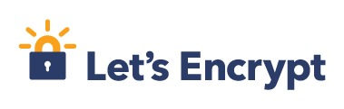

The [Electronic Frontier Foundation](https://www.eff.org),
[Mozilla](https://www.mozilla.org), [Akamai](http://www.akamai.com),
[Cisco](https://www.cisco.com) and [IdenTrust](https://www.identrustssl.com)
have setup a free certificate authority (CA) called
[Letsencrypt](https://letsencrypt.org) that
enables anyone to get free SSL certificates to enable you to secure your
web servers with encryption. Plus, there's the added benefit that Google will
love you just a little bit more in the search rankings ;)

There's no reason not to be using https for all your web connections anymore.
Do it! I'll show how.

This tutorial assumes you already have a working [nginx](https://nginx.org)
web server. The following examples come from using my [EC2](https://aws.amazon.com/ec2/)
instance running [Ubuntu](https://www.ubuntu.com).


ACME
----

Letsencrypt uses a protocol called [ACME](https://github.com/ietf-wg-acme/acme/)
(Automated Certificate Management Environment) for determining if you are really
the owner of the domain for which you're requesting a cert. The basic way it
works is that it will genreate some files that you post to a directory on your
server which it (letsencrypt) can access over port 80 on your domain. If you're
able to do that, then you must be the owner of that domain.

There's a bunch of technical stuff to do to set everything up securely and
automate the process. I'll try to explain each step. Ultimately you want to
create a special user just for handling cert renewal with letsencrypt who can
write to a special challenges directory that your webserver can serve and who
can update your cert and restart your server. This user won't be allowed to do
anything else on the server so that its permissions are limited to this one
task only. From there, your web server user can read the cert and use it to
server your web content over an SSL connection on port 443.

In this tutorial, I'll be making use of
[Daniel Roesler](https://daylightpirates.org)'s excellent script called aptly
[acme-tiny](https://github.com/diafygi/acme-tiny) which will help you
automate the process with as little code as possible (so you can read it
yourself and audit it to ensure it is doing what you intend it to do).


Create a New User
-----------------

First, create a new user who's sole purpose in life is to get new SSL certs
from Letsencrypt using your server's private key for your domain name, install
the cert to a directory accessible by nginx, and reload nginx to make use of it.

NOTE: The following commands are being run as the default 'ubuntu' user that
comes with new EC2 instances unless otherwise stated.

Create new user called *letsencrypt* (use a different name if you like).

```bash
$ sudo adduser letsencrypt
```

Depending on your setup, you may be prompted with an interactive session to
enter user profile information like full-name, phone number, etc. These are
all optional and can be skipped. The important part is when it asks for a new
password. Make it strong, and don't forget it ;) I store all my passwords on
an encrypted volume inside a [password manager](https://agilebits.com/onepassword)
(which itself encrypts its data).

If you weren't asked for a password when you ran `adduser`, create a password
explicitly using the `passwd` command.

```bash
$ sudo passwd letsencrypt
```

Also, create a new group called *letsencrypt* (or whatever you like) so that you
can assign permissions that only members (and root) may use.

```bash
$ sudo addgroup letsencrypt
```

You can list users in a group to make sure the *letsencrypt* user is a member.

```bash
$ getent group letsencrypt
```

If the *letsencrypt* user is not already a part of the group, add it.

```bash
$ sudo adduser &lt;username&gt; &lt;groupname&gt;
```

You can delete a user (if you need to, if you made a mistake).

```bash
$ sudo userdel letsencrypt
$ sudo rm -rf /home/letsencrypt
```


Allow Letsencrypt User to Reload nginx
----------------------------------------

Give user *letsencrypt* permission to restart nginx with the `sudo` command.

```bash
$ sudo EDITOR="vi" visudo -f /etc/sudoers.d/letsencrypt-nginx-reload
```

I like using the *vi* editor, but choose whatever you like (I believe the
default on Ubuntu is *nano*). In the above command, you'll be creating a new
file called 'letsencrypt-nginx-reload' (I thought that was an apt description
of what it's doing) in the `/etc/sudoers.d` folder. This will automatically be
loaded when sudo permissions are being set.

Add the following line to the sudoers file.

```
letsencrypt ALL=NOPASSWD: /usr/sbin/service nginx reload
```

*WARNING*: Be really careful when you edit your sudoers file not to leave any
syntax errors as this could require you to do all sorts of fancy (read: not fun)
stuff to fix it and regain root access (e.g., detach disk volume, mount new
instance, fix error, remount original... or worst case: rewrite entire disk
image). Make sure you use the `visudo` command rather than directly editing
these files! I learned this the hard way :P


Create a Place to Put Your SSL/Letsencrypt Stuff
------------------------------------------------

I chose to create a folder specifically for dealing with all the files I use
for SSL. You could use any folder (like the default `/etc/ssl` folder), but I
found it cleaner and easier to understand when I had only the things I'm
interested in in one place (e.g., the `/etc/ssl` folder has all kinds of other
certs you probably won't be using which make your files get lost in the noise).

Run the following commands to create a folder called *letsencrypt* in `/etc` with
two subfolders that will hold different files with different permissions.

```bash
$ sudo mkdir /etc/letsencrypt
$ sudo mkdir /etc/letsencrypt/certs
$ sudo mkdir /etc/letsencrypt/private
```

Make 'root' the owner, but *letsencrypt* the group, for everything in the new
folder you just created. This will allow root to change anything, but also give
you a hook to give specific, limited, access to the *letsencrypt* group of users.

```bash
$ sudo chown -R root:letsencrypt /etc/letsencrypt
```

Now, make some more specific permissions for each folder ('letsencrypt' needs to
be able to write to the `certs` folder, but shouldn't be able to modify
anything else, only read stuff). `750` means read/write/exec for root (because
root is the owner), and members of the group can read and exec; others can't do
anything. `775` means read/write/exec for both owner (root) and group
(letsencrypt), but others only may read and exec from this folder. The certs folder
has this more permissive setting because other users (like the user running
nginx) need to be able to read the certs that get written to this directory.

```bash
$ sudo chmod 750 /etc/letsencrypt
$ sudo chmod 775 /etc/letsencrypt/certs
$ sudo chmod 750 /etc/letsencrypt/private
```

The reason you're making all these fancy permissions is because you want to limit
who has access to your secret keys. In this case, the goal is going to be to
allow your special *letsencrypt* user to be able to read the necessary private
keys from `/private` and create new certs in `/certs` while being able to access
scripts we'll later be adding to the root of the `/etc/letsencrypt` directory.
You don't want other users, like nginx, to be able to read anything in the
`/private` directory so that *only* the *letsencrypt* user manages that
(actually we're going to limit letsencrypt even further on a file-by-file basis
so it only has access to what it absolutely needs to make a cert). This way the
things that touch the sensitive information are sectioned off from the things
that run your public servers and the two can't touch, keeping your SSL certs safe
(and legit).


Create Keys
-----------

Because of the restrictive permissions you put on your directories above, for
simplicity, just switch to the root user for the following commands so you have
full access to write and create files.

On AWS EC2 Ubuntu setups, you can simply switch to root using this command
without a password (assuming you're already logged in as the default `ubuntu`
user over SSH):

```bash
$ sudo -i
```

Create an account private key using 4096-bit RSA.

```bash
$ openssl genrsa 4096 &gt; /etc/letsencrypt/private/account.key
```

Create a domain private key (needs to be different than account key).

```bash
$ openssl genrsa 4096 &gt; /etc/letsencrypt/private/domain.key
```

Create dhparam parameters (for [Perfect Forward Secrecy](https://en.wikipedia.org/wiki/Forward_secrecy)
using [Diffie-Hellman key exchange](https://en.wikipedia.org/wiki/Diffie%E2%80%93Hellman_key_exchange)).
Using 4096 bits will take a *really* long time to generate, so you may want to
get up and grab a coffe while this runs. You can reduce it to 2048 bits if you
like (can be up to 8 times faster to generate), which is still considered
crazy-secure. I just like being *super*-crazy-secure ;)

```bash
$ openssl dhparam -out /etc/letsencrypt/certs/dhparam.pem 4096
```

I decided to put the DH params file in the `/etc/letsencrypt/certs` directory,
simply for convenience. This folder will be accessible by Nginx and it
keeps all your SSL stuff in a common place. You don't have to put it there if
you think it doesn't belong there.

Also see:

- http://security.stackexchange.com/questions/38206/can-someone-explain-a-little-better-what-exactly-is-accomplished-by-generation-o
- https://scotthelme.co.uk/squeezing-a-little-more-out-of-your-qualys-score

Finally, create a CSR (certificate signing request) for your desired domains.

For a single domain:

```bash
$ openssl req -new -sha256 -key /etc/letsencrypt/private/domain.key -subj "/CN=yoursite.com" &gt; /etc/letsencrypt/private/domain.csr
```

Or, for multiple domains (use this one if you want both www.yoursite.com and
yoursite.com, for example):

```bash
$ openssl req -new -sha256 -key /etc/letsencrypt/private/domain.key -subj "/" -reqexts SAN -config &lt;(cat /etc/ssl/openssl.cnf &lt;(printf "[SAN]\nsubjectAltName=DNS:yoursite.com,DNS:www.yoursite.com")) &gt; /etc/letsencrypt/private/domain.csr
```


Configure Nginx
---------------


Configure Nginx to use SSL and setup a public "challenges" endpoint to be used
by Letsencrypt to verify ownership of the domain you're using.

First, create "challenges" directory (the `-p` flag will also make any parent
directories that don't already exist above "challenges"). I like putting all my
web stuff in `/var/www`. In there, make a special directory called
"challenges" just for storing your challenge files for ACME (or use a different location if you so desire).

```bash
$ mkdir -p /var/www/challenges
```

I like using Nginx's default 'sites-available' and 'sites-enabled' folders for
my configs. This way I can separate my app-specific stuff from the root config.
You need to setup a location on port 80 that ACME can use for its challenge
files (which we'll be putting in `/var/www/challenges`). Make a file called
'your-website' (or a more descriptive name) in `/etc/nginx/sites-available`.

```bash
$ vi /etc/nginx/sites-available/your-website
```

...with the following config settings:

```nginx
server {
    listen 80;
    server_name yourdomain.com;

    location /.well-known/acme-challenge/ {
        alias /var/www/challenges/;
        try_files $uri =404;
    }
}
```

This will tell nginx to listen on port 80 for requests made to your domain and
serve any static files that are in there (or 404 if they're not).

Hook it up to the running Nginx process by symlinking to it from
`/etc/nginx/sites-enabled`.

```bash
$ ln -s /etc/nginx/sites-available/your-website /etc/nginx/sites-enabled/your-website
```

Last, reload Nginx to load the new config you just added.

```bash
$ service nginx reload
```

If you want to run a sanity test that this is all hooked up properly, create
a simple text file in `/var/www/challenges`, with some random text (e.g., "test
test test") and then try to access it from your browser.

```bash
$ vi /var/www/challenges/test
```

Then try accessing it from your browser by navigating to the following URL:
`http://yourdomain.com/.well-known/acme-challenge/test`.

If you downloaded the file, you're good. If not, there's likely a permission
problem.

Remove the file when you're done.

```bash
$ rm /var/www/challenges/test
```


Setup Letsencrypt
-----------------

Make sure Python 2.7 is installed (EC2 ubuntu comes pre-installed
with Python 2.7.6 as of this writing).

```bash
$ python --version
```

Install [acme_tiny.py](https://github.com/diafygi/acme-tiny) in the root of
the `/etc/letsencrypt` directory (this is where you'll put all your SSL-related
scripts you want to run when renewing your certs). It's just a small, single,
file script, so I just copied the code from Github and pasted it into a file
with vi over my SSH connection.

```bash
$ vi /etc/letsencrypt/acme_tiny.py
```

At this point, switch to your special *letsencrypt* user who is the one
that should be doing all the cert stuff.

```bash
$ su letsencrypt
```

Then, get your free, signed, SSL certificate!

```bash
$ python /etc/letsencrypt/acme_tiny.py --account-key /etc/letsencrypt/private/account.key --csr /etc/letsencrypt/private/domain.csr --acme-dir /var/www/challenges/ &gt; /etc/letsencrypt/certs/signed.crt
```

Install the certificate by chaining it together with Letsencrypt's intermediate
cert.

```bash
$ wget -O - https://letsencrypt.org/certs/lets-encrypt-x1-cross-signed.pem &gt; /etc/letsencrypt/certs/intermediate.pem`

$ cat /etc/letsencrypt/certs/signed.crt /etc/letsencrypt/certs/intermediate.pem &gt; /etc/letsencrypt/certs/chained_cert.pem`
```

I've called the resulting file "chained_cert.pem" but feel free to name it anything you like ;)

*WARNING*: Be careful how many times you request a new cert.
As of this writing, there is a rate limit of 5 certs per 7 days per 
domain. While I was writing this article I requested too many certs in 
testing out different configurations and was then blocked for a week.


Setup SSL for Nginx
-------------------

Update the `/etc/nginx/sites-available/your-website` file to handle the
SSL-served pages you want to deal with by making a second "server" block to listen on port 443.

```nginx
server {
    listen 443;
    server_name www.yoursite.com;

    ssl on;
    ssl_certificate /etc/letsencrypt/certs/chained_cert.pem;
    ssl_certificate_key /etc/letsencrypt/private/domain.key;
    ssl_session_timeout 5m;
    ssl_protocols TLSv1 TLSv1.1 TLSv1.2;
    ssl_ciphers ECDHE-RSA-AES256-GCM-SHA384:ECDHE-RSA-AES128-GCM-SHA256:DHE-RSA-AES256-GCM-SHA384:ECDHE-RSA-AES256-SHA384:ECDHE-RSA-AES128-SHA256:ECDHE-RSA-AES256-SHA:ECDHE-RSA-AES128-SHA:DHE-RSA-AES256-SHA:DHE-RSA-AES128-SHA;
    ssl_session_cache shared:SSL:50m;
    ssl_dhparam /etc/letsencrypt/certs/dhparam.pem;
    ssl_prefer_server_ciphers on;

    # ...the rest of your config
}
```

Read more about SSL ciphers:

- https://raymii.org/s/tutorials/Strong_SSL_Security_On_nginx.html
- http://nginx.org/en/docs/http/ngx_http_ssl_module.html
- https://hynek.me/articles/hardening-your-web-servers-ssl-ciphers/
- http://security.stackexchange.com/questions/54639/recommended-ssl-ciphers-for-security-compatibility-perfect-forward-secrecy

Reload nginx to use the new cert.

```bash
$ sudo service nginx reload
```


Automate all the things!
------------------------

Letsencrypt certs only last 90 days. I don't know about you, but I don't want to
have to log into my server and run these commands every few months (I know I'll
forget and then my website will stop working). So you should automate it with a
cron job.

Switch back to your regular user by typing `exit` and create a new file called
"renew_cert.sh".

```bash
$ exit
$ vi /etc/letsencrypt/renew_cert.sh
```

Put the following code in this file (these are the same commands you just ran):

```bash
#!/bin/sh
python /etc/letsencrypt/acme_tiny.py --account-key /etc/letsencrypt/private/account.key --csr /etc/letsencrypt/private/domain.csr --acme-dir /var/www/challenges/ &gt; /etc/letsencrypt/certs/signed.crt || exit
wget -O - https://letsencrypt.org/certs/lets-encrypt-x1-cross-signed.pem &gt; /etc/letsencrypt/certs/intermediate.pem
cat /etc/letsencrypt/certs/signed.crt /etc/letsencrypt/certs/intermediate.pem &gt; /etc/letsencrypt/certs/chained_cert.pem
sudo service nginx reload
```

Switch back to user *letsencrypt* to create a user-specific crontab that will
run the cert renewal as *letsencrypt* (which does not have access to run
anything else).

```bash
$ su letsencrypt
```

Edit the crontab with 'vi' editor for the current user *letsencrypt*.

```bash
$ EDITOR="vi" crontab -e
```

Use the above bash script and use the following crontab to run it at
3:30am on the first of the month, every other month (plenty of time 
within the 90 day expiration window in case something doesn't work).

```
30 3 1 Jan,Mar,May,Jul,Sep,Nov * /etc/letsencrypt/renew_cert.sh &gt;&gt; /var/log/acme_tiny.log
```


Batten down the hatches
-----------------------

Last thing to do is to set some extra restrictions on the permissions for all
these files to ensure that nobody who shouldn't have access can mess things up.

Switch back to your regular user.

```bash
$ exit
```

Change ownership of your two script files so the *letsencrypt* group can run them.

```bash
$ sudo chown root:letsencrypt /etc/letsencrypt/acme_tiny.py
$ sudo chown root:letsencrypt /etc/letsencrypt/renew_cert.sh
```

And change the permissions on them so only root can write, and group can only
read/execute.

```bash
$ sudo chmod 750 /etc/letsencrypt/acme_tiny.py
$ sudo chmod 750 /etc/letsencrypt/renew_cert.sh
```

Now, harden the permissions on your private key files. The *letsencrypt* user only
needs to be able to read your `account.key` and your `domain.csr`. It should
*not* be able to see your `domain.key`.

```bash
$ sudo chown root:letsencrypt /etc/letsencrypt/private/account.key
$ sudo chown root:letsencrypt /etc/letsencrypt/private/domain.csr
$ sudo chmod 640 /etc/letsencrypt/private/account.key
$ sudo chmod 600 /etc/letsencrypt/private/domain.key
$ sudo chmod 640 /etc/letsencrypt/private/domain.csr
```

Last, make `/var/www/challenges` accessible to *letsencrypt*.

```bash
$ sudo chown root:letsencrypt /var/www/challenges
$ sudo chmod 775 /var/www/challenges
```

That's it! Make https the default for the web. Enjoy free, self-renewing,
secure SSL for your website!

Special thanks to Michael Stitt for helping me with typos and editing some
parts that were unclear :)
