Amazon's cloud services are arguably the cheapest and most stable platform on
which to build a distributed set of web services and applications. I've chosen
to build my next web app using their EC2 service because of it's easy, consistent
installation and control of all the features I want. If you're looking to do
something similar, this article will show you how to get up an running.

Choose EC2
----------

First step is, choose "EC2" from the plethora of Amazon Web Services. This is
a virtual server that will have its own operating system image installed and
allow you a small amount of disk-space, RAM, and CPU (which is configurable
of course). This is a great place to start building a new app from the ground
up. As your app grows and you start hitting scaling issues, you can, from here,
swap out components that have bottle-necked into other, more dedicated,
services (e.g., need more storage for user generated content? save that into
an S3 bucket instead of on your EC2 instance).

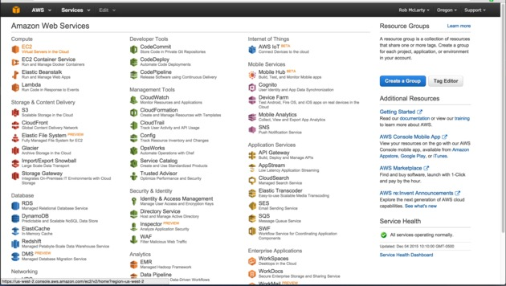

Launch a New Instance
---------------------

From the EC2 Dashboard, you want to click on the big blue button that says
"Launch Instance". This is what gets you started making a new server.

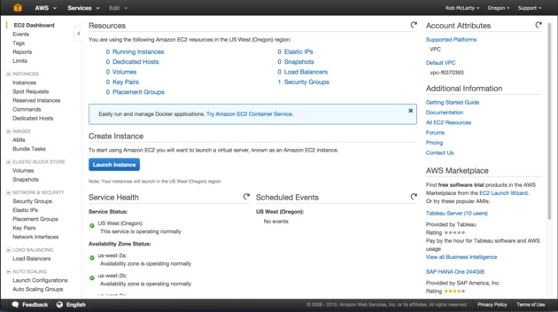

Pick an Operating System
------------------------

Choose your desired operating system. There's lots of stuff
to choose from and your choice will depend on your needs. Personally, I really
like Ubuntu because it is debian based and comes with the amazing apt-get
package manager which makes installing server software a breeze.

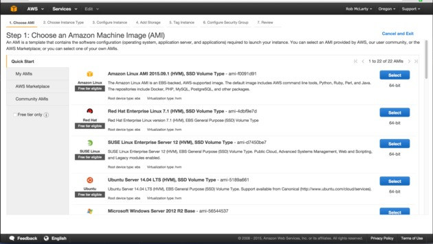

Choose an Instance Type
-----------------------

Choose what type of instance you want. There is a range,
from small to big. The bigger the instance, the more money it will cost you. If
I remember correctly, when you setup your first `t2.micro` instance, it will be
free (but has limited resources).

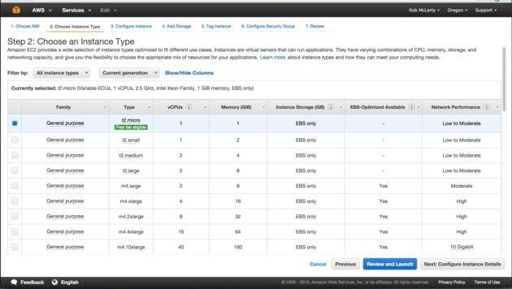

Instance Details
----------------

This step allows you to tweak your instance's settings. The defaults
are usually pretty good.

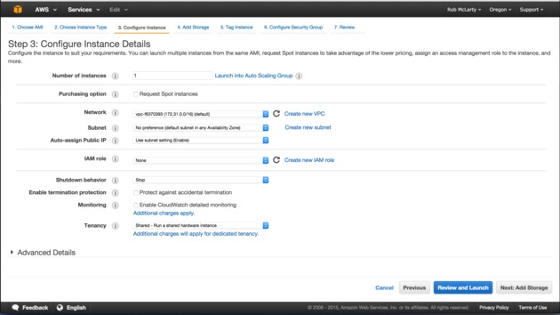

Configure Security Group
------------------------

This is important: configuring your instance's security group. What
this does is make a group of protocol and port settings that your instance will
be permitted to use. So, for example, if you want to use your instance as a web
server, you'll need to open up ports 80 and 443 (ssl). It's also a good idea to
have port 22 open so that you can SSH into your instance and actually do stuff
with it ;)

One thing to note is that you can restrict those ports even further, down to a
specific IP address. So, for instance, you may want to restrict all SSH access
only from your own personal IP address so that only a user coming from your
actual internet connection could ever possibly connect over that channel. The
web ports, however, you probably want to leave wide open so anyone in the world
can actually see your web app. Choose the security options you like, and proceed
to the next step.

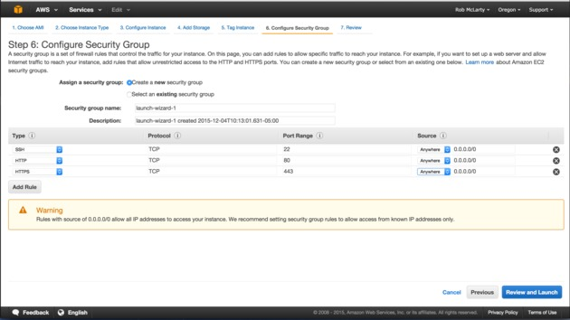

Review
------

The last step of the "launch" process presents you with a review screen. Check
over all the settings to make sure they're what you intended and then hit the
big blue "Launch" button in the bottom right of the screen.

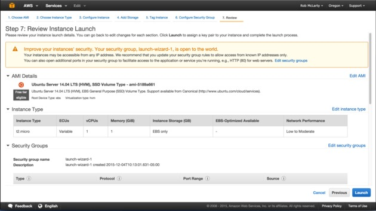

Security Key Pair
-----------------

After pressing "Launch" you'll be presented with a modal window that will ask you
to choose an encryption key pair (for SSH) that you want to use for accessing your
new instance. If you don't already have an existing key-pair to choose from the
drop-down, choose "Create a new key pair" instead and make a new one.

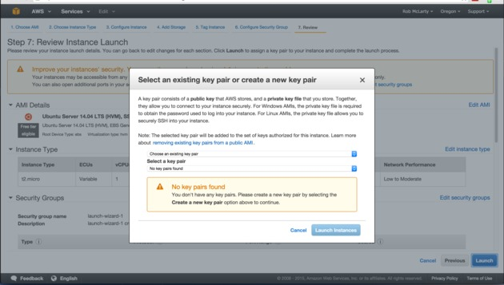

Create a New Key Pair
---------------------

Creating a new key pair is as easy as giving it a name and then hitting the
"Download Key Pair" button. The name you choose is what will show up in the
drop-down when you go to choose which key pair to use. Save the key to your
local disk in a secure location which can't be accessed by anyone but you and
ssh. I like making a folder just for my ssh keys which has permissions only for
my user to read and not modify.

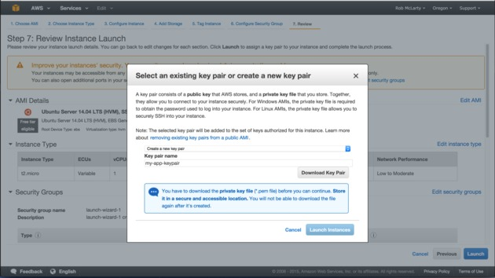

Launch
------

After choosing your key pair, the launch process will begin. The resulting page
should notify you when your instance is ready to go.

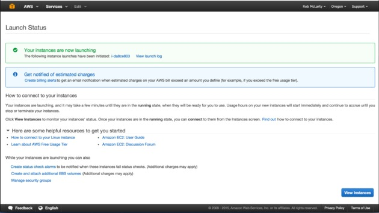

Check It Out
------------

If you clicked the "View Instances" button on the previous screen, or if you
choose "Instances" from the left hand EC2 menu, you'll see a screen which will
list all your currently active EC2 instances along with some status information.
Most importantly, this will tell you what IP address your instance is running on.
Make a note of that so you can connect to it over SSH later ;)

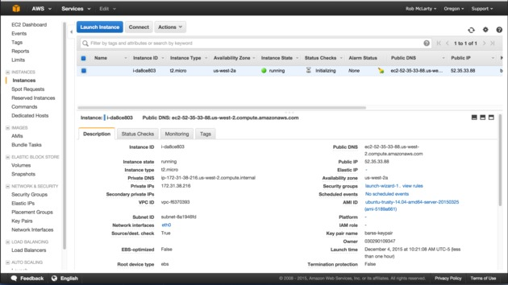

And that's it! From here, you'll be able to connect to your instance over SSH
and install whatever it is you want to install on it.
