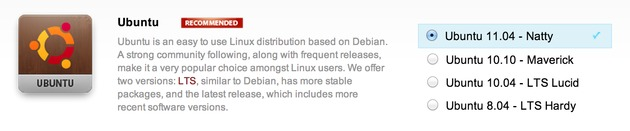
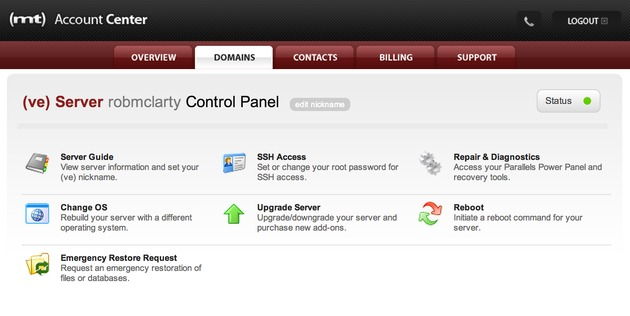
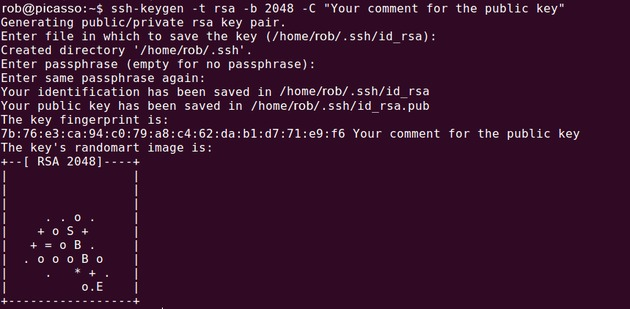
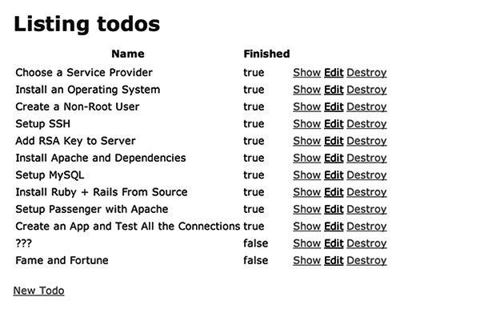

Choose a Service Provider
-------------------------

I already had an account with [Media Temple](http://mediatemple.net/),
so I thought that keeping all my cloud junk together and staying with
MT would make things easier to manage, for me personally. I'm not
getting paid to endorse MT in any way. Without my existing relationship I
could have just as easily gone with something like
[Rackspace](https://www.rackspace.com/cloud/vps/),
[Linode](https://www.linode.com/), or even [Heroku](https://www.heroku.com/).

I was previously using MT's [DV server](http://mediatemple.net/webhosting/dv/)
which is a pre-installed setup that comes with a custom CentOS and Plex
configuration. But I noticed that when using this setup for clients,
each time I ordered a new one, the configurations changed and I had to
figure out how to solve problems I had already dealt with when I wanted
to put together the same small Rails/Passenger production system I've
used for all my apps. I was looking for something I could repeat
on-demand with minimal unknowns. I wanted a workable recipe for putting
new apps online that could handle a moderate load and get any of my apps
from MVP to scaling problems in a predictable manner (at which point,
my thinking was, I'd be in a position to work with people smarter than
me to help with more elaborate configurations).


So for my production server (the one running this blog) I chose to go with Media
Temple's [VE server](http://mediatemple.net/webhosting/ve/).
 It's a fresh install of an OS of your choice that lets you start from
scratch and maintain full control. The key is that it came blank and
only included what I put on it myself. This allowed me to start from,
and stay with, known variables and make the process I developed
repeatable (making subsequent installs require a lot less grey matter).


Install an Operating System
---------------------------

My choice of OS was Ubuntu 11.04 (although I would have preferred
12.04.2 LTS, but 11.04 is the newest version of Ubuntu MT offers). I
wanted something newish and I wanted something with easy package
management. Being based on Debian, Ubuntu gave me access to the great
[Advanced Packaging Tool](https://en.wikipedia.org/wiki/Advanced_Packaging_Tool)
(APT) which has made installing many libraries and dependencies a snap.



The following are the steps I took to get from brand-new Ubuntu install from
Media Temple's account centre through to a working
[Ruby 2.0](https://www.ruby-lang.org/en/news/2013/02/24/ruby-2-0-0-p0-is-released/)
on [Rails 4.beta](http://weblog.rubyonrails.org/2013/2/25/Rails-4-0-beta1/)
app running on [Apache 2](http://httpd.apache.org/) and
[Phusion Passenger 4.rc4](http://blog.phusion.nl/2013/03/05/phusion-passenger-4-0-release-candidate-4/)
([rc6](http://blog.phusion.nl/2013/04/09/phusion-passenger-4-0-release-candidate-6/)
just came out as I'm writing this).


Create a Non-Root User
----------------------

The very first thing I did was create a new user on my new server that isn't
`root`. Running everything as `root` is bad for security. In fact, I even
disabled being able to login in as `root` so it's impossible for anyone to gain
root-access to my server at all.



In Media Temple's Account Centre (their web interface where you pay
for the stuff) there are a few simple tools, one of which is for
generating a new root user password. I generated a new super-strong
password (I keep track of all my logins with [1Password](https://agilebits.com/onepassword)
and use it to generate new unique passwords) and saved it through the
web interface. That done, I left the web interface behind and jumped
into the CLI to interact with the server via [SSH](https://en.wikipedia.org/wiki/Secure_Shell).

On my local machine, in a terminal, I logged in like this (entering my password
I just generated when prompted).

```bash
ssh root@xxx.xxx.xxx.xxx
```

Once in, I created a new non-root user, and created a home directory
while I was at it (for this article I'm going to use "bill" as the
username).

```bash
useradd -d /home/bill -m bill
```

Next, I made a good password for my new user (generating another
strong password with 1Password, but you could just make one up yourself
that jives with whatever password management process you use).

```bash
passwd bill
```

And finally, I made my new user a sudoer so it (*aside*: does a user account on
a server have a gender?) can do root level tasks when needed.

```bash
visudo
```

This will open the `vi` text editor for the sudoer file (you're going to have to
get your `hjkl` on to navigate the file; if you've never used `vi` before,
here's a [cheatsheet](http://www.lagmonster.org/docs/vi.html)).
I just added the following line below where the root user's privileges
are defined (obviously, use your own username for your server).

```bash
bill ALL=(ALL) ALL
```


Setup SSH
---------

As I said before, it's a good security measure to prevent `root`
from being able to login through SSH altogether (that's why I created a
new user). It's also a good idea to use a non-standard port number for
SSH so it's hard for automated bot scripts to figure out where to look
in the first place. I noticed when I installed a new server previously
and left the port at the standard 22, weird connections from Kazakhstan
and Russia where constantly trying to gain access, albeit
unsuccessfully. Better to make it that much harder for them to find you.

First, still logged in as `root`, I backed-up the existing `sshd_config` to
root's home folder.

```bash
cp /etc/ssh/sshd_config ~
```

Then, I edited the active config file.

```bash
vi /etc/ssh/sshd_config
```

I changed the following lines to disable root login, use a
non-standard SSH port number, and white-list my new user (note that the
AllowUsers is added to the very bottom of the file).

```
Port 4321
PermitRootLogin no
...
AllowUsers bill
```

Then I saved and reloaded the SSH daemon to enabled the new config settings.

```bash
service ssh restart
```

or

```bash
/etc/init.d/ssh restart
```

For the curious, you can list all current SSH connections to your server with
the command [netstat](http://en.wikipedia.org/wiki/Netstat). You'll sometimes be
surprised with what's trying to access your server.</p>

```bash
netstat -algrep ssh
```


Add RSA Key to Server
---------------------

Adding an RSA key to the server allows access without the need for
inputting your password every time. If you use a strong password like
me, this will save you some hassle (I use a 50 character password with
upper and lower case letters, at least 10 numerals, and at least 10
special symbols). This will also make it easier to run remote commands
from your deployment scripts without being interrupted by password
prompts so deployments go faster and smoother, requiring much less of
your attention and making it possible for fast iterations.

On the remote server...

```bash
mkdir ~/.ssh
```

On my local machine, after having already [created an RSA key](https://help.ubuntu.com/community/SSH/OpenSSH/Keys)
in `~/.ssh` using [OpenSSH](https://www.openssh.org/), I copied my public key to
the remote server's `authorized_keys` file.



```bash
cat ~/.ssh/id_rsa.pub | ssh bill@xxx.xxx.xxx.xxx -p 4321 'cat - &gt;&gt; ~/.ssh/authorized_keys'
```

Back on the remote server, I changed the file permissions of `authorized_keys`.

```bash
ssh bill@xxx.xxx.xxx.xxx
sudo chmod 600 ~/.ssh/authorized_keys && chmod 700 ~/.ssh/
```

Then I checked the permissions on `authorized_keys` as a sanity check.

```bash
ls -la ~/.ssh | grep "authorized_keys"
```

The output should be something like this:

```
-rw------- 1 bill bill  403 2013-04-05 11:55 authorized_keys
```

And on ssh directory,

```bash
ls -la ~ | grep ".ssh"
```

The output should be something like:

```
drwx------  2 bill  bill  4096 2013-04-05 11:55 .ssh
```


Install Apache and Dependencies
-------------------------------


Installing Apache has never been easier using `apt-get`.

First, I updated the repositories.

```bash
sudo apt-get update
```

Then fixed the locales.

```bash
sudo locale-gen en_US en_US.UTF-8 en_CA.UTF-8
sudo dpkg-reconfigure locales
```

And finally installed all the basic packages I thought I'd need.

```bash
sudo apt-get install apache2 curl git build-essential zlibc zlib1g-dev zlib1g libcurl4-openssl-dev libssl-dev libopenssl-ruby apache2-prefork-dev libapr1-dev libaprutil1-dev libreadline6 libreadline6-dev
```


Setup MySQL
-----------


I'm used to using [MySQL](https://www.mysql.com/)">MySQL
as my starting database server. You could alternatively use a more
exotic NoSQL DB or Postgres or whatever floats your boat. Here I stuck
with my old friend.

```bash
sudo apt-get install mysql-server
```

Once installed, I needed to open a MySQL session using the server's root
password so I could make a new database and user.

```bash
mysql -p
```

From inside the mysql console, I created a new database, a database
user, and assigned privileges to that user with a strong password (a *new*
password for the database being created).

```sql
create database billdb;

grant all privileges on billdb.* to 'billdb_usr'@'localhost' identified by 'a-super-strong-password';

flush privileges;
```


Install Ruby + Rails From Source
--------------------------------


I wanted to setup the bleeding edge on this server, so I went with a
source code install process for Ruby rather than a pre-existing package.
I installed [Ruby 2.0](https://www.ruby-lang.org/en/news/2013/02/24/ruby-2-0-0-p0-is-released/)
and Rails 4.beta. What I usually do to keep track of my source-code-installed
components is create a `src`
directory in my user's home folder inside which I store all my source
code folders for compilation, installation, and later, any
uninstallation I might need to do.

But before that, I needed to install a few more dependencies so my server
environment was ready for it.

```bash
sudo apt-get install build-essential libyaml-dev libsqlite3-0 libsqlite3-dev sqlite3 libxml2-dev libxslt-dev autoconf libc6-dev ncurses-dev automake libtool bison subversion
```

Next, inside `/home/bill/src` and got the latest Ruby, decompressed it,
configured, compiled, and installed.

```bash
wget ftp://ftp.ruby-lang.org/pub/ruby/2.0/ruby-2.0.0-p0.tar.gz
tar xzvf ruby-2.0.0-p0.tar.gz
cd ruby-2.0.0-p0
./configure
make
sudo make install
```

Next, I made a symbolic link from `/usr/local/bin/ruby` to `/usr/bin/ruby`
because some programs look for it there.

```bash
sudo ln -s /usr/local/bin/ruby /usr/bin/ruby
```

The newer Rubies come with `rubygems` so you don't need to
worry about installing that separately anymore. But before installing
any new gems (like Rails) it's always a good idea to make sure it's up
to date.

```bash
sudo gem update --system
```

Finally, now that there was a convenient `beta1` branch for the Rails gem, all
I needed to do was install the latest Rails was the following.

```bash
sudo gem install rails --version 4.0.0.beta1
```

I encountered some weird issues with `rdoc` and `ri`
where I had to answer "yes" to overwrite the existing versions. I just
went with it since this is a dedicated server and I care more about the
app working than some documentation that isn't necessary for me in
production. I'm sure this will be fixed in the final release.

**Update**: [@kaspergrubbe](https://twitter.com/kaspergrubbe) gave me a great
little tweak so you don't need to specify `--no-ri --no-rdoc` every time you
install a gem in production: just add `gem: --no-rdoc --no-ri` to `~/.gemrc`
(create that file if it doesn't already exist) and don't worry about `ri` or
`rdoc` again in production.


Setup Passenger with Apache
---------------------------


Phusion Passenger has been by far the easiest way I've found for
managing multiple Rails application instances on top of either Apache or
Nginx. It comes as a gem and has custom modules for both major web
servers. For Rails 4 I wanted to go with the latest version, which is
already packaged up into `pre` for easy installation through `rubygems`.

```bash
sudo gem install passenger --pre
```

Once the gem was installed, I just ran the custom source compilation
script to get the web server modules installed. I chose to go with
Apache, so I'm using the Apache install script. For Nginx, you'd just
use `passenger-install-nginx-module` instead.

```bash
sudo passenger-install-apache2-module
```

The first time I ran `passenger-install-apache2-module` I encountered an error
because it wanted to use `/tmp` to execute temporary code, but `/tmp` was set to
`noexec` by default which prevents this (this is a good thing, so remote
attackers can't execute arbitrary code where the server stores uploaded
files). The error shows up as an issue with `curl`.

To work around this issue, rather than remounting the real `/tmp`, I temporarily
bound `~/tmp` to `/tmp` and then unmounted it when I was finished.

```bash
mkdir ~/tmp
sudo mount --bind ~/tmp /tmp
sudo passenger-install-apache2-module
sudo umount /tmp
```

**Update**: Hongli Lai from [Phusion](http://www.phusion.nl/) writes that "you
can just run `passenger-install-apache2-module` with the `TMPDIR`
environment variable set to a directory without `noexec`" so you don't need to
bind-mount the `/tmp` directory to work around the above issue.

With passenger installed, I then added two files to `/etc/apache2/mods-available`.
The Debian Apache package manages modules and sites through directories
and symlinks rather than a single monolithic config file. This is new
to me, but I like it. ([read more](http://www.control-escape.com/web/configuring-apache2-debian.html))

First, I created a file called `/etc/apache2/mods-available/passenger.load` and
input the following code:

```apacheconf
LoadModule passenger_module /usr/local/lib/ruby/gems/2.0.0/gems/passenger-4.0.0.rc4/libout/apache2/mod_passenger.so
```

Second, I created a file called `/etc/apache2/mods-available/passenger.conf`
and input the following code (you could tweak these settings, but I've found
this is a good starting point):

```apacheconf
PassengerRoot /usr/local/lib/ruby/gems/2.0.0/gems/passenger-4.0.0.rc4
PassengerRuby /usr/local/bin/ruby
PassengerMaxPoolSize 6
PassengerPoolIdleTime 0
PassengerMaxRequests 1000
```

Then, I enabled the passenger module in Apache and restarted server.

```bash
sudo a2enmod passenger
sudo service apache2 restart
```

I then checked what modules apache was loading to verify passenger
was in the list. At first it wasn't working for me because I hadn't
activated the module using the `a2enmod` command. So this is a useful check:

```bash
apache2ctl -t -D DUMP_MODULES
```


Create an App and Test All the Connections
------------------------------------------



Finally, I created a test app directly on the remote server and fired
it up to check that all the different pieces I just installed were
working together.

First, I moved the default apache page to its own directory so I
could put other custom directories of my own (like for my app) in the
`www` directory and not have a default `index.html` file capable of rendering
at its root.

```bash
sudo mkdir /var/www/default
sudo mv /var/www/index.html /var/www/default/index.html
```

I usually make all folders directly under `www` the name of the domain or site
I want to serve (e.g., `/var/www/robmclarty.com`). Later, if I want to make a
separate microsite on a subdomain or something, I can make a new folder here
(e.g., `/var/www/subdomain.robmclarty.com`).

Next, I edited the default apache `vhost` to point to
`/etc/apache2/sites-available/default`

```apacheconf
…
DocumentRoot /var/www/default
…
<Directory /var/www/default/>
…
Options FollowSymLinks # Remove Indexes
```

**Update**: Dan Vokt writes that it would be easier to just use the `a2ensite`
command to do this... I didn't think of that because I'm new to managing things
with this command. Thanks Dan!

Then I created a new test app with a mysql setup, to kick the tires
and ensure the server was properly configured (this is done from inside
the `/var/www/default` directory). I added a simple 'todo' scaffold with a
`name` and a `finished` attribute that could be the beginning of a basic
todo-list app (just to test some actual usage, not simply loading the default
page).

```bash
sudo rails new testapp --skip-bundle -d mysql
cd testapp
sudo bundle install
sudo rails g scaffold todo name:string finished:boolean
```

I edited `database.yml` to connect to the database I made earlier.

```yaml
production:
  adapter:  mysql2
  encoding: utf8
  database: billdb
  username: billdb_usr
  password: your-super-strong-password
```

I edited `routes.rb` to make the default view point to something real.

```ruby
root to: 'todos#index'
```

And finally I updated the app and restarted passenger.

```bash
sudo bundle install --deployment --without development test
sudo bundle exec rake db:migrate RAILS_ENV=production
sudo bundle exec rake assets:precompile RAILS_ENV=production
sudo touch /var/www/testapp/tmp/restart.txt
```


Configure Virtual Host to Point to App
--------------------------------------

The final step in configuring the server was to setup a custom
virtual host to point Apache to the new app directly (i.e., without
needing to use any port numbers or anything). To do that, I edited the
file `/etc/apache2/sites-available/testapp`.

```apacheconf
<VirtualHost _default_:80>
  # ServerName www.yourhost.com # Commented out for default
  DocumentRoot /var/www/testapp/public # be sure to point to public
  <Directory /var/www/testapp/public>
    AllowOverride all
    Options -MultiViews
  </Directory>
</VirtualHost>
```

I activated the new site.

```bash
sudo a2ensite testapp
```

I deactivated the default site.

```bash
sudo a2dissite default
```

And reloaded apache to enabled the new configurations.

```bash
sudo service apache2 reload
```

That's it! Now, when I pointed to my server's IP address I was able
to see my newly created Rails app and it worked properly (albeit with no
authentication, haha).


In [a future post](/words/articles/how_to_deploy_a_rails_4_app_with_git_and_capistrano),
I'll walk through setting up a new app locally and using capsitrano to
deploy it to the production server, as well as installing ImageMagick
for doing fancy image processing server-side when users upload bitmaps
to your app.

If you have any questions, or notice something in this process that could be
improved, please let me know.


Update
------

This post was featured [on Ruby5](http://ruby5.envylabs.com/episodes/371-episode-367-may-7th-2013/stories/3239-how-to-setup-a-production-server-for-rails-4)
and [Ruby Weekly](http://rubyweekly.com/archive/144.html). Thanks guys!

Kurt Sussman emailed me with some good suggestions to fine-tune your server
setup even further:

1. Use `ssh-copy-id` to [get your public key onto your server](http://www.thegeekstuff.com/2008/11/3-steps-to-perform-ssh-login-without-password-using-ssh-keygen-ssh-copy-id/)
  in fewer steps. I wasn't sure how to do this with a custom port number, but
  found [some solutions](http://unix.stackexchange.com/questions/29401/is-it-possible-to-run-ssh-copy-id-on-port-other-than-22)
  to get around this.
2. Speed up Ruby even further with some environment variable tuning (`tcmalloc` lib can be installed via `apt-get`):
  ```
  <pre><code> export RUBY_GC_MALLOC_LIMIT=1000000000
   export RUBY_HEAP_SLOTS_GROWTH_FACTOR=1.25
   export RUBY_HEAP_MIN_SLOTS=800000
   export RUBY_FREE_MIN=600000
   export LD_PRELOAD=/usr/lib/libtcmalloc_minimal.so.4
  ```
3. Consider using a provisioning script to automate all this setup nonesense
  like [5minbootstrap]https://github.com/phred/5minbootstrap).

