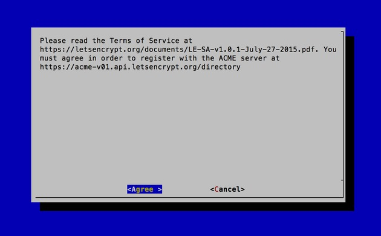
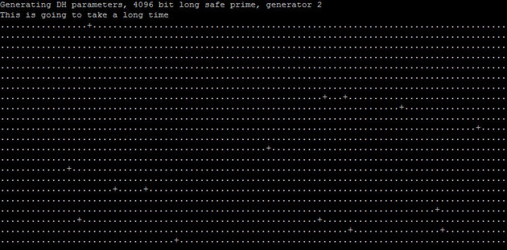

[Letsencrypt](https://letsencrypt.org) now has a [plethora of clients](https://letsencrypt.org/docs/client-options)
available to help you make it as painless as possible to install free
SSL(TLS) certificates on all of your websites. That is, there is really 
no good reason why your website doesn't have https now. Do eet!


Getting Started
---------------


The first thing you'll want to do is install one of the Letsencrypt clients on
your server system. Here, I'm using [Certbot](https://certbot.eff.org)
(by EFF) on Ubuntu 14.04 (trusty) with nginx 1.10 and openssl 1.0.1f.
Certbot has great guides on how to install it on many different systems.
Check out its site for more details.

Because I'm on Ubuntu 14.04 and it doesn't come with the Certbot package, I need
to install the `certbot-auto` script. On newer systems (e.g., Ubuntu 16)
Certbot comes in an easily installable package (e.g., `apt-get install letsencrypt`).
But for me on my slightly older system, I do this:

```bash
$ wget https://dl.eff.org/certbot-auto
$ chmod a+x certbot-auto
```

I just put this in my home directory, but feel free to put this wherever you like.


Get New Certs
-------------

Next, run the script with the necessary options. On my server, I have
two websites being served by nginx from two independent directories
under `/srv/opt`. Other common locations might be `/var/www/html` or `/usr/share/nginx/html`.
The point is, you need the full path to wherever you store your static
web files so that Certbot can create some temporary files there and 
allow the Letsencrypt servers to verify that you do indeed own the 
domain(s) for which you're requesting a cert.

I'm going to use the `certonly` flag along with the [webroot plugin](https://certbot.eff.org/docs/using.html#webroot).
By using webroot's `--webroot-path` flag (simply `-w` for short) you can
specify multiple domains all in one command like this:

```bash
$ /path/to/certbot-auto certonly --webroot -w /srv/opt/example -d example.com -d www.example.com -w /srv/opt/otherstuff -d otherstuff.io -d m.otherstuff.io
```

This command will get a single cert for `example.com`, `www.example.com`,
`otherstuff.io`, and `m.otherstuff.io`. It does this by first placing some
temporary files under `/srv/opt/example` (which your web server
should serve to the the outside world) to prove you control the first two
domains, and then under `/srv/opt/otherstuff` for the second
pair of domains.

Here is a real-world example I just did on one of my own servers
which runs a simple chat app I'm working on along with a separate 
authentication server:

```bash
$ ~/certbot-auto certonly --webroot -w /srv/opt/chat -d chat.robmclarty.com -w /srv/opt/auth -d auth.robmclarty.com
```

What you'll see after executing this command is a bunch of stuff
scroll past your screen and finally an interactive session. This will 
prompt you for an email address (for urgent notices and lost key 
recovery) and it will ask you to agree to the Letsencrypt ToS. Once 
done, it will install your new cert, and chain, under `/etc/letsencrypt`
in a folder named for the first domain you used
(e.g., `/etc/letsencrypt/live/www.example.com`). This cert will contain all of
the domains you specified, so you can use the same cert for each of them.



After obtaining the cert, you will have the following PEM-encoded files all
found under `/etc/letsencrypt/live/www.example.com/`:

- **cert.pem**: your domain's certificate
- **chain.pem**: the Letsencrypt chain certificate
- **fullchain.pem**: `cert.pem` and `chain.pem` combined
- **privkey.pem**: your certifcate's private key

What's actually going on is that the cert files themselves are stored under
`/etc/letsencrypt/archive` (with appropriate permissions) and symbolic links
are created under `/etc/letsencrypt/live/www.example.com`.
This way, once you've configured your web server to point to these
symbolic links, every time Certbot updates the certs, it will simply 
update to where those symbolic links point and your web server will be 
none the wiser. Easy.

Since these files are locked down under strict permission settings,
your regular user account won't be able to access the directory where 
they're stored. You can check that the files exist by running this 
command (substituting in your own domain name):

```bash
$ sudo ls -l /etc/letsencrypt/live/www.example.com
```

The output should show a list of the 4 files described above.

Before configuring your web server, and to further enhance security,
it's a good idea to create a strong Diffie-Hellman group. To generate a 
2048-bit key, use this command:

```bash
$ sudo openssl dhparam -out /etc/ssl/certs/dhparam.pem 2048
```

This will take a while (especially if you want to use something more
than 2048 bits... I like using 4096 bits on all my servers, which takes 
like over 20 minutes sometimes, depending on the entropy already on the 
system). So grab a coffee and come back later when all the dots are 
finished dotting (you'll see). In the end, you'll get a new file located
at `/etc/ssl/certs/dhparam.pem`.




Configure Your Web Server (Nginx)
---------------------------------

Now you can setup your web server for SSL/TLS just as you normally
would, only using the file locations you created above. The 3 files 
you're concerned with here are `fullchain.pem`,
`privkey.pem`, and `dhparam.pem`.

I'm not going to go into all the details of configuring Nginx here,
but assuming you already have an existing setup, the lines you'll want 
to modify are as follows:

```nginx
ssl_certificate /etc/letsencrypt/live/www.example.com/fullchain.pem;
ssl_certificate_key /etc/letsencrypt/live/www.example.com/privkey.pem;  
ssl_dhparam /etc/ssl/certs/dhparam.pem;
```

...and, if you're using `ssl_stapling`, you'll want to modify this line too:

```nginx
ssl_trusted_certificate /etc/letsencrypt/live/www.example.com/fullchain.pem;
```


Automated Renewal
-----------------

You can setup Certbot to automatically renew your certificates before
they expire. Letsencrypt certificates only last for 90 days (but it's
free, so you can just get new ones whenver you need them). You can do it
manually if you *want* but who wants to remember to log into
their server every 90 days and renew their certs when you can just tell 
the server to do it by itself?

You can test automatic renewal for your certificates by running this command:

```bash
$ /path/to/certbot-auto renew --dry-run
```

If that worked, you can setup a `cron` or `systemd` job which runs the following command:

```bash
$ /path/to/certbot-auto renew --quiet --no-self-upgrade
```

You can read more about the [details on auto-renewal](https://certbot.eff.org/docs/using.html#renewal) on EFF's site.

EFF recommends running your cron or systemd job twice per day!
Basically the idea is that it won't do anything until your certs are 
legitimately due for renewal (Letsencrypt just ignores the renewal 
request if your cert is still good) but this increased frequency ensures
that your site has a chance of staying online in case Letsencrypt
intiates a revocation for some reason or their servers are unavailable. 
It is recommended therefore to choose a random minute within the hour 
for running your renewals (so everyone isn't hammering the server at 
exactly the top of the hour).

So, if you're using cron, you would first edit the crontab for the root user like this:

```bash
$ sudo crontab -e
```

Then add the following lines:

```
48 3,15 * * * /path/to/certbot-auto renew &gt;&gt; /var/log/letsencrypt-renew.log
53 3,15 * * * /etc/init.d/nginx reload
```

Note that I'm using randomly chosen minutes as recommended by EFF and
renewing at 3:48am and 3:48pm every day (along with restarting nginx 5
minutes after initiating each renewal to give it some time to complete 
before restarting the server). Renewal logs are sent to
`/var/log/letsencrypt-renew.log` so you can check that it's working (or not).
You can name the log file whatever you like.

That's it. Now you can sleep at night knowing your website is secured
for all your users and that it will automatically renew its certs as
long as your server is online. Enjoy your pretty new green lock icon 
beside your domain name :)


References
----------

- [Letsencrypt](https://letsencrypt.org)
- [Certbot](https://certbot.eff.org)
- [DO Ubuntu 14.04 Tutorial](https://www.digitalocean.com/community/tutorials/how-to-secure-nginx-with-let-s-encrypt-on-ubuntu-14-04)
