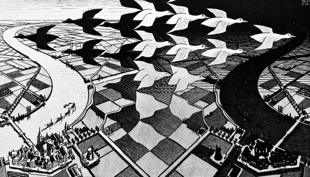

Focus, grind, and validate. What you create doesn't need to be a
fucking masterpiece. In a universe seemingly out of our control,
**something is better than nothing; nothing is the default**.

I personally have a problem with finishing my projects due to
complexity, obsessive thinking, loss of interest (ADHD), and/or burn-out.
I don't claim to have a secret formula for getting things done, nor an exhaustive
list of requirements. But I believe I have *some* insights, and I'd like to
share what I'm able to share, and maybe help you move things forward.

Some of the Key Ingredients
---------------------------

What I've noticed over the years of working on making stuff is that
there are certain components of productive experience that are recurring
 and common. Not every project is the same, but they each share these 
essential phenomena that I believe hold some of the keys to reaching 
completion. That is, simply reaching the finish line (of course, more 
and different work is still required to reach fame and riches beyond 
completion). In my personal experience, the following key components are
necessary (but probably not sufficient) for completing a large project.

- **inspiration** (giving a fuck)
- **motivation** (energy)
- **tools** (building blocks)
- **skills** (capacity to execute and use the necessary tools)
- **vision** (of the finish line; the shining glorious end)
- **planning** (of the path that leads to the finish line: mvp, baby steps, iterations, etc.)
- **validation** (reassurance from friends, family, and target audience that what you're doing is not a waste of time)
- **lots of grinding and grunting** (the work)
- **focus** (that getting to the first goal is the first step to reaching the
  next goal; don't get hung up continually introducing new and amazing things
  your project can do; finish the first thing first)

Lack of any one of these components can, in my experience, derail a project.

Struggling to Maintain Long-Term Focus
--------------------------------------

For me, my greatest weakness is long-term focus. I'm actually really
good a tuning out background noise, delving deep into thought for any 
given problem, and connecting some very complex dots (i.e., short-term 
focus). But over a long period of time (think months and years) I struggle
to retain focus on the big picture and drift into tangent work as new ideas
enter my mind.

What usually happens is that I start creating something, realize that
the tools I'm using for creating aren't good enough, start making
better tools myself, get lost in the complexity of making awesome tools,
get depressed because I'm not creating anything anymore, then just play
video games to take my mind off things.

I love organizing information. I don't know why. It just gives me
good feels. So when I start doing something I very easily fall into the 
trap of wanting to organize it so it all "makes sense". I'm not talking 
about the making-things-tidy-and-clean kind of organized; I'm talking 
about breaking out into re-organizing human thought around the entire 
genre that encapsulates the problem-space I'm currently exploring kind 
of organized. This is probably why I like studying Philosophy so much. 
The problem is, philosophy never ends, it tries to (re)define the 
problem itself, and ends up creating more and more problems along the 
way. With this, my projects never end either.

So there's that.

There's also my internal belief that the journey is more fun than
reaching the destination. So I have this unconscious saboteur that works
 to keep my projects going so I can ever-exist in a state of doing. 
That's cool and all, but it doesn't achieve results in a way that pays 
my bills.

I always think to myself that I should be open to new things and if
it's a good idea, it should obviously be incorporated because it will 
just make things that much better. But the reality (as I've found) is 
that it only delays the original goal, and often takes you farther away 
from it in the pursuit of an ever increasing list of newer and better 
goals (which themselves get delayed and forgotten for what's over the 
horizon). I think there's a lot to be said for just sticking to your 
guns, **standing your ground**, and gettin'er done. And getting something
(anything) actually *done* feels wicked!

Reality and Illusion
--------------------

Another trap I've noticed in myself, which I realized when I read an
article about the phenomenon (I've lost the reference), is that
**the human mind can play tricks on itself and make itself feel like it has done something even when it hasn't**.
So to put it in addiction-type words: when I finish something, I get
some good feels. This motivates me to seek out new good feels so I can 
feel them again. And so I continue creating and making and building (and
that's awesome), but I can also get *some* of those good feels just by *thinking*
about finishing something. When I have that vision of the end-product
and I go to bed at night dreaming of it already being done and how 
awesome everyone will think I am, I give myself a little bit of that 
feeling. And now, having felt it already, and looking at the long road 
ahead of me, I might not be as motivated to continue my journey and 
prefer to just sit back and dream about what it would be like if… Slap 
yourself in the face and pour cold water on your head if you get this 
far. **Dreaming is a good thing, but *only* dreaming is living a lie**
(I'll hold off on what defines the nature of reality for another article, haha!).

Personally, for all intents and purposes, I feel as if I'm existing
in a world full of other consciousnesses that interact with and 
influence me, and I them. I feel like **we're all sharing a global cultural bubble of ideas and thought**
(e.g., when you're born in the 21st century you think about networks
and computers whereas ten thousand years before you might have thought 
about rocks and furs). This library of ideas that we share with each 
other, and build upon and pass on to subsequent generations, is amazing 
and is one of my primary motivators for wanting to create stuff (i.e., I
want to add some of my own stuff to that library). But if I just hold
my stuff in my head the whole time and die with it, it's gone, for good.
Maybe other people could have had some of the good feelings I had.
Maybe they could have been able to make some even awesomer ideas using 
mine as building blocks. I don't know. But I *think* that there
are a few cool things in my mind and I feel a little morally obligated 
to at least share what I've concocted and put it out there. That's a 
little metaphysical perhaps, but it's one reason I think it's good to 
actually *do* something and not just think about it.

Just Do
-------

**What you create doesn't have to be pretty, and certainly doesn't have to be some kind of genius-masterpiece**.
*Something* is better than nothing, and we can all help each other do it. That's
culture. Don't panic, and just do it ;) I hope this helps motivate you a
little bit or maybe more critically reflect on your own process and how
you can fine-tune it a bit more so you get creating (as in finishing) your stuff.
