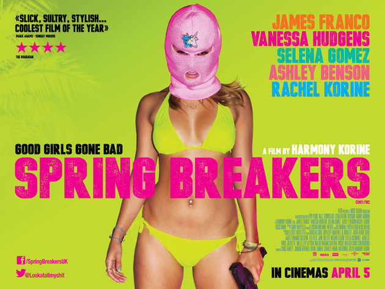

I just saw [Harmony Korine](https://en.wikipedia.org/wiki/Harmony_Korine)'s
*[Spring Breakers](http://www.imdb.com/title/tt2101441/)*,
and I liked it. I can see how many people would think it was overly
gratuitous or voyeuristic, but I think it needed to be. It showed how 
our dreams are tangled with our lives by our desires.

Like Korine's other movies, the meaning of Spring Breakers wasn't
explicitly spelled out; which allowed viewers to input heir own 
interpretations into the film. I think that's what makes a good movie 
(and good art). Rather than sitting in my seat like a zombie watching a 
predictable plot unfold, I felt mesmerized in the neon hallucinogenic 
dreamscape of the spring break these four girls were experiencing, 
trying to understand why the events were happening the way they were. 
I'm still processing what I just saw, but I saw some interesting 
patterns.

I think any art that's worth experiencing necessarily pushes us to
the boundaries of what we're comfortable with; to force us to reflect on
our own place in space and time and find connections between our
experiences that we didn't see before. It should help us step out of our
solitary boxes and look back at what's inside ourselves through
different eyes. Spring Breakers is like this.

My take was that the "spring break forever" motto was for those
seeking to cling to their effervescent fantasies, oblivious of the world
around them, living in a perpetual dream. But in life and reality
everything necessarily comes to an end (e.g., we will all eventually 
die). When Faith felt intense fear from Alien's world of metal teeth and
drugs and wrongness, she fell out of the dream, just as Cotty did when
she was shot. Brit and Candy continued, not dissuaded to give up their 
continued existence in the dreamscape of Alien's other world and pushed 
themselves to the limits of what they could find possible. But even for 
them, the spring break would eventually end and they would need to find a
new dream to chase.

I think it's like we can choose our actions and decide when to change
or we can let Fate choose for us. There's good and bad experiences
either way. I don't think we can necessarily know which way is better or
worse. Life in a dream, in a virtual reality, or in an hallucination,
is just as visceral as life without. Our reality is defined by our 
consciousness. [Wittgenstein](https://en.wikipedia.org/wiki/Tractatus_Logico-Philosophicus)
said "The limits of my language are the limits of my world".
That's what I like to think this movie was trying to explore.
