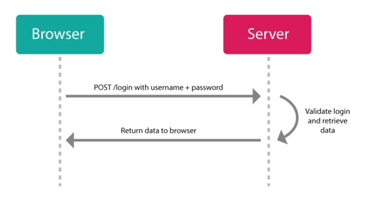
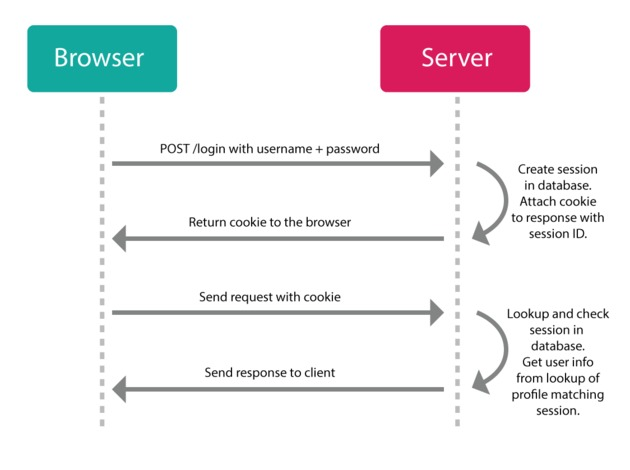
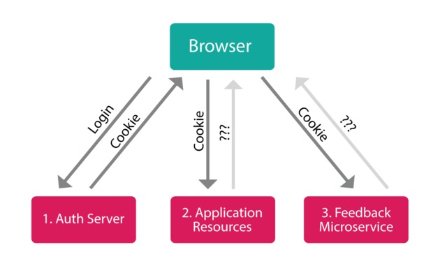
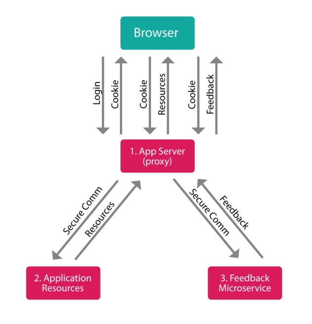
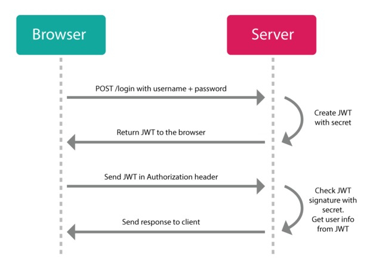
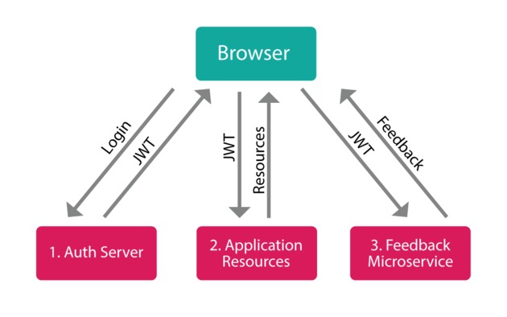

> "A [JSON Web Token (JWT)](https://tools.ietf.org/html/rfc7519), pronounced 'jot',
> is a compact URL-safe means of representing claims to be transferred between two
> parties. The claims in a JWT are encoded as a JSON object that is digitally
> signed using JSON Web Signature (JWS)".


How we used to do authentication
--------------------------------



HTTP is a *stateless* protocol. That means it doesn't remember anything from
request to request. If you login for one request, you'll be forgotten, and will
need to login again to make another request. As you can imagine, this can get
very annoying fast.

The old-school solution has been to create what's called a "session". A session
is implemented in two parts:

1. An object stored on the server that remembers if a user is still logged in,
  a reference to their profile, etc.
2. A cookie on the client-side that stores some kind of ID that can be
  referenced on the server against the session object's ID.


Cookie-based Auth
-----------------



If a user visits a web page (makes a request) and the server detects a session
cookie, it will check if it currently has a session stored with the ID from the
cookie, and if that object is still valid (whatever that means: not expired, not
revoked, not blacklisted, etc.).

If the session is still valid, it will respond with the requested web page (or
data). If it finds a session object, that object can contain data in it and with
that, the server can "remember" who you are and what you were doing (e.g., if this
is an ecommerce store, what products you've added to our shopping cart).

If the session is not valid (or no session cookie was detected) it will respond
with some sort of error message saying that the request is "unauthorized".

New sessions can typically be created by sending a username/password combination
to a specific endpoint from a login page. If the server can match a user with
that username and password, it will generate a new session object on the server
and set a cookie on the client with the session's ID for any future requests.

If a user turns off their computer and comes back to the website some time in
the future, s/he can either automatically login again (if there is still a
cookie in the browser that hasn't expired) or login again through the login
page. Once logged in, the user's session can be retrieved again from the data
stored on the server, and the user can go on with their business (e.g.,
continuing to shop after reloading your shopping cart).

This type of setup has worked pretty well for us since the web came out and
since we've been visiting web sites that do most of their "thinking" on the
server side. Typically this has been a conversation between the user's frontend
browser and a corresponding backend server in a one-to-one relationship.



This setup still works, but these days we have many different situations that
require different setups (e.g., multiple mobile native apps alongside large
single-page web apps contacting multiple backend services, that may be
nothing more than json data without a webpage at all). In these types of
scenarios, the cookie you get from one server, won't correspond (or even be
sent) to another server (let alone the problems that get created with CORS).


Drawbacks With Cookie-based Auth
--------------------------------



- **Multiple Backends**: What if your app needs to talk to a database backend as
  well as a separate image processing backend? more and more, our digital world
  is being split up into separate micro-services; when authenticating with more
  than one backend, things can get complicated (e.g., you could either proxy
  all requests through a central app server which would then need to *know* all
  the logic of each secondary service, or each service could implement complex
  inter-server communication (and CORS) to verify incoming session IDs with a
  central auth server... in either case extra load on the app server is required
  and more complex interconnects need to be maintained).
- **Sessions**: need to be stored somewhere, either in memory, in a database, or
  keyvalue store like Redis; and they need to be managed so that they are
  removed when they expire or are otherwise invalidated.
- **Poor Scalability**: The session store needs to be scaled when scaling the
  server. The store uses up resources, and adds complexity.
- **Performance Issues**: When the session needs to be stored on the server, a
  lot of database/store lookups need to happen on every request which can bog
  down the server.
- **Native Apps (or non-browser apps)**: Browsers handle cookies, but custom
  apps don't (at least not easily), so a different kind of session mechanism is
  needed.
- **CSRF**: If cookies are being used, extra security is needed to prevent
  cross-site request forgergy attacks since the cookie will be automatically
  sent to the server with any request made from that site.
- **CORS**: Cookies + CORS don't play well across different domains (actually,
  real cross-domain doesn't work at all).


JSON Web Tokens Are Better
--------------------------

JWTs don't use sessions, have no problem with native apps, and actually don't
even need special CSRF protections, and they works like a charm with CORS.



With JWT you register yourself with an app (much the same way you would with an
old-school app) and you login with your credentials (e.g., username/password, or 3rd party OAuth).
But instead of making a session and setting a cookie, the server will send you a
JSON Web Token instead. Now you can use that token to do whatever you want to do with the
server (that you have authorization to do).

Think of it like a hotel key: you register at the front-desk, and they give you
one of those plastic electronic keys with which you can access your room, the
pool, and the garage, but you can't open other people's rooms or go into the
manager's office. And, like a hotel key, when your stay has ended, you're simply
left with a useless piece of plastic (i.e., the token doesn't do anything
anymore after it's expired).



In a multi-server setup, you could also imagine a JWT akin to a
"Festival Pass" like you would get at a film or music festival. Whereas
an individual movie ticket will grant you access to a single movie (from
which you can leave to get popcorn or use the restroom and return), a
Festival Pass will grant you access to any movie in the entire festival
at different locations at different times. In the same way, you can take
your JWT generated from one server, and use it to authenticate with
totally different servers (on different domains) which share the same
verification method (e.g., share a secret). Each of those other servers
don't need to "call home" to ask if the token is ok, because they can
simply do a quick computation on the token itself and check its
signature and expiration time directly without incurring a hit to the
database or an additional network request.


How JWT Works
-------------

A JWT is self-contained. When you create one, it has all the necessary pieces you
need to do the things you want to do on a server packaged up inside it.
There are 3 main parts, separated by a ".":

- a header
- a payload
- a signature

The header normally contains two things: 1. the type of the token (how the payload
can be interpreted), and 2. the name of the algorithm used to make the signature
(e.g., `{typ: 'JWT', alg: 'HS256'}`). This gets encoded into base64.

The payload is a JSON object of data. You can put whatever you want in it (e.g.,
`{userId: 2}` or maybe even `{userId: 2, admin: true}`. This also gets encoded
into base64.

The signature is a hash of the encoded header, the encoded payload, and a
"secret" key that you provide (stored safely on the server) using the algorithm
defined in the header.

At the end, you get a string that looks something like "xxxxxxxx.yyyyy.zzzzzzzz"
where "x" is the encoded header, "y" is the encoded payload, and "z" is the
encrypted signature.

The header and payload can be easily decoded on the front-end or the back-end to
retrieve any information you want in there (it's just base64). Keep this in mind because these
values are essentially "public", so don't put any private information in there
like a credit card number or a password or something.

Whenever you make a request to the server, you send the token with your request.
Typically this is done in the authorization header like
`Authorization: Bearer xxxxxx.yyyyy.zzzzzz`. But it could also be passed in a
POST body or in the URL itself as a query parameter.
When the server sees the token, it decodes it and compares the signature with
the secret it has stored which would have been used to generate the token in the
first place. If everything matches, the request is authentic, and it responds
with data, otherwise it sends back an error message.

Here's a real token example. You can use this nice service [jwt.io](https://jwt.io/)
to easily inspect the token if you want to see what's inside it.

```
eyJ0eXAiOiJKV1QiLCJhbGciOiJIUzI1NiJ9.eyJpc3MiOiJodHRwOi8vZX
hhbXBsZS5vcmciLCJhdWQiOiJodHRwOi8vZXhhbXBsZS5jb20iLCJpYXQiO
jEzNTY5OTk1MjQsIm5iZiI6MTM1NzAwMDAwMCwiZXhwIjoxNDA3MDE5NjI5
LCJqdGkiOiJpZDEyMzQ1NiIsInR5cCI6Imh0dHBzOi8vZXhhbXBsZS5jb20
vcmVnaXN0ZXIiLCJjdXN0b20tcHJvcGVydHkiOiJmb28iLCJuYW1lIjoiUm
9iIE1jTGFydHkiLCJpZCI6Nzh9.-3BnaA1XRiKh8e7zy9ZRTETf8Vngoypq
rVW98oQnH4w
```

The server takes information from the token's payload (e.g., like a "userId")
and constructs its response accordingly. This is how the server "remembers" the
user... because it can use the id it finds to check the user's name and
other profile information against it's account in the database (or it can
simply use what data is in the payload directly without hitting the
database at all). If special access rights have been granted to the user, those
can be retrieved from the token as well (e.g., admin privileges).

The key to all this (pun intended) is the "secret" string that is stored on the
server. This is a piece of information that only the server knows which is used
to make new tokens and validate existing ones. Because the server is the only
thing that knows the secret, it prevents unauthorized access by attackers
because it would be technically too difficult to decrypt a captured signature,
or to guess the secret in order to spoof a contrived signature before an issued
token expires. Remember to never share your secret with anybody and to send it
to your server over a secure line (e.g., using SSH).

You can also setup other servers to use the same secret so that a token created
by one server could also be used to authenticate with a completely different
server (client to server, or server to server). More advanced setups can also be
created using JWA (JSON Web Algorithms) where a central auth server stores a
single secret and third-party servers receive a public key generated from that
secret and use the public key to request authentication services from the auth
server when the third-party server gets a request (suffice it to say, there are
lots of different ways of setting things up; it's very flexible).

If an attacker tries to tamper with the payload data (e.g., to give themselves
admin rights), the corresponding signature won't match (because the signature
was generated from the original data in the payload) and as such that token
won't be considered valid on the server and any requests made with it will be
denied. The only way to create an authentic token is with the secret (which
should only be on the server and never published).

A JWT can also include other useful information in its payload, called "claims".
Most important is an expiry date. If an expiry date is included, the token will
automatically become invalid when that date has passed.


Standard JWT Claims
-------------------

There is a set of standard properties you can use in your payload to handle
different use-cases in your app.  Claims like this can be used to increase the
security of your system to prevent a number of different kinds of attacks. Be
sure to check what's available in the library you choose.

- **iss**: the issuer of the token
- **sub**: the subject of the token
- **aud**: the audience of the token
- **exp**: this will probably be the registered claim most often used. This will
  define the expiration as a NumericDate value. The expiration MUST be after the
  current date/time.
- **nbf**: defines the time before which the JWT MUST NOT be accepted for processing
- **iat**: the time the JWT was issued. Can be used to determine the age of the JWT
- **jti**: unique identifier for the JWT. Can be used to prevent the JWT from
  being replayed. This is helpful for a one time use token.

Example payload:

```json
{
  "iss": "http://example.org",
  "aud": "http://example.com",
  "iat": 1356999524,
  "nbf": 1357000000,
  "exp": 1407019629,
  "jti": "id123456",
  "typ": "https://example.com/register",
  "custom-property": "foo",
  "name": "Rob McLarty",
  "id": 78
}
```


How to Invalidate a JWT
-----------------------

The coolest part of a JWT is that its claims can include its expiration settings
and because the signature is a function of the hash of these settings, all the
server needs to do is check the expiration info when it verifies the token and
reject it if it has expired. What this means is that you don't need to worry too
much about it. After issuing a token, just leave it out in the wild and let it
die on its own.

Obviously not every app can afford to do this. Sometimes having a valid token
out in the open for even an day is potentially too long (e.g., perhaps to grant
a user access to their account if they forgot their password). Sometimes you may
only want a token to be used once-only (e.g., for a password reset). Other times
you may have a malicious user registered in your system whom you want to ban
altogether so that any tokens they've already created can't be used to access
the system anymore.

These scenarios can be handled (if needed) through a combination of JWT claims
and server-side mechanisms. Keep the following options in mind when considering
token invalidation and expiry:

- remove the token from the client
- maintain a token blacklist
- keep expiry times short

The first option simply "throws out" the token and lets it expire on its own.

The second option is a bit more involved in that it tracks actual tokens stored
on the server (e.g., in a database or key/value store) and uses this list during token verification
to check if a token has been blacklisted. This is kind of the opposite of
session stores, but it's still more performant because as tokens naturally
expire, they can simply be removed from the blacklist. The blacklist is only
needed to invalidate a token that has not yet expired.

Finally, in general, you should keep your token expiration times short anyway
(like under 24 hours; maybe just 1 or 2 hours) so that in a worst-case scenario,
an attacker only has less than a day to take advantage (which is likely not
nearly enough time to brute-force the signature's encryption, even with a
super-computer... the jury's still out on quantum computers).


Advantages of JWTs
------------------

- **No Session to Manage (stateless)**: The token has everything you need to
  identify users, and the rest of your app's state can be stored in
  local storage on the client side. No need for a session object stored on the server.
- **Portable/Homogenous**: A single token can be used with multiple backends, even on different domains.
- **No Cookies Required**: You can store the token
  however we want: e.g., in localStorage, indexDB, or some native store
  (or cookies, if you really want).
- **Mobile Friendly**: Developing native apps (iOS, Android, Windows 8, etc.) is
  difficult and cumbersome with cookies (e.g., you have to deal with cookie
  containers), but adopting a token-based approach greatly simplifies this.
- **Built-in Expiration**: JWT has standard claims that can be set in the
  payload when a new token is created. Nothing more needs to be done.
- **Don't Need to Logout**: Just throw away the token when you're done with it, it will expire on its own.
  You usually want to give a short expiration time, but if you really want to,
  you can keep track of a "blacklist" of tokens that are marked as "invalid" on
  the server which could be added to from an explicit logout, or from an
  administrator marking certain tokens as invalid.
- **Works with CORS**: A token-based auth approach allows you to make AJAX calls
  to any server, on any domain because you can use an HTTP header to transmit the
  user information.
- **Leverage CDNs**: You can serve all the assets for your app from a CDN (e.g.,
  javascript, HTML, images, etc.) and your server side can just be a stateless API.
- **Easy to Debug**: JWTs can be inspected and their data reviewed (whereas
  sessions are stored on the server and are a lot harder to see and understand).
- **Decoupled/Decentralized**: The token can be generated anywhere.
  Authentication can happen on the resource server, or easily separated into
  its own server, or "self-issued", or otherwise be completely externalized.
- **CSRF Doesn't Matter**: because if you don't have a token, you can't do
  anything. Since you don't need to rely on cookies, you don't need to protect
  against cross site requests (e.g., it would not be possible to `<iframe>` your
  site, generate a POST request, and re-use the existing authentication cookie
  because there will be none) since the JWT needs to be explicitly included
  in the request header, and doesn't get set automatically like a cookie.
- **Good Performance**: A network round-trip (e.g., finding a session in the
  database, deserializing it, then extracting the information you're interested
  in) is likely to take more time than calculating a HMACSHA256 to validate a
  token and parse its contents.
- **Standard-Based**: Read the spec: [RFC 7519](https://tools.ietf.org/html/rfc7519)
  supported by multiple backend libraries (.NET, Ruby, Java, Python, PHP,
  Javascript), and companies backing their infrastructure (e.g., Firebase,
  Google, Microsoft, Zendesk).

That's it! Go forth and free yourself from your cookie oppressors!


References
----------

- [node-jsonwebtoken](https://github.com/auth0/node-jsonwebtoken)
- [Why Cookies are Bad](https://www.kb.cert.org/vuls/id/804060)
- [Make your Angular app a max security prison](https://www.youtube.com/watch?v=lDb_GANDR8U) (video)
- [MNUG 2014 - Lightning talk: JWT: JSON Web Token](https://www.youtube.com/watch?v=eWUkxzyB1Rk) (video)
- [Auth0](https://auth0.com/docs/jwt)
- [JWT.io](http://jwt.io/)
- [Json Web Tokens: Introduction](http://angular-tips.com/blog/2014/05/json-web-tokens-introduction/)
- [Securing Requests with JWT](http://websec.io/2014/08/04/Securing-Requests-with-JWT.html)
- [The useful little standard you haven't heard about](http://www.intridea.com/blog/2013/11/7/json-web-token-the-useful-little-standard-you-haven-t-heard-about)
- [The anatomy of a JSON Web Token](https://scotch.io/tutorials/the-anatomy-of-a-json-web-token)
- [Using JSON Web Tokens as API Keys](https://auth0.com/blog/2014/12/02/using-json-web-tokens-as-api-keys/)
